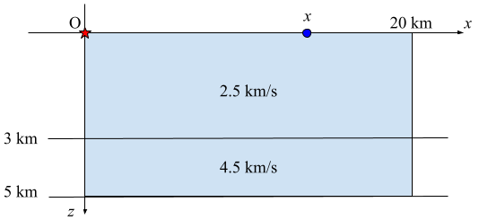

# 【JP08 機械学習を用いた地震波解析】問題文

つぎの各問にすべて答えてください。それぞれの問で指定する方法でレポートを作成してください。

## 第1問

反射法地震探査 (reflection seismology) について、つぎの問い (問1・問2) に答えてください。
解答は A4 用紙 1 ページ以内のレポートとして作成し、PDF ファイルを提出してください。
必要に応じて図表を用いたり、他の文献を適切に引用することは差し支えありません。
また、レポート作成にあたっては、多くの文献を参照することを推奨します。

### 問1

反射法地震探査について調べ、つぎの 4 つの点を説明してください。

- 反射法地震探査の目的
- 地震波の発生機構
- 反射波の発生機構
- 地震波の観測方法

### 問2

幅 20 km、深さ 5 km の 2 次元速度構造における波の伝播について考えます。
速度構造は水平 2 層であり、第 1 層の深さは 5 km 未満です。
速度構造の外周は吸収境界であり、波の反射は起こらないとします。
震源を原点 $(0, 0)$ に、受振器を地表 $(x, 0)$ $(0 < x < 20)$ にそれぞれ配置します。

(1) 受振器には「直達波 (direct wave)」「反射波 (reflection)」「屈折波 (refraction)」とよばれる 3 種類の波が到達し、この合成波形が観測されます。
これらの波は震源から受振器までの波線 (波の到達経路) が互いに異なります。それぞれの波線を [Q2-1.png](Q2-1.png) に描き込んで図示してください。

(2) 震源で発生した波が、震源を出てから受振器に到達するまでにかかる時間を走時 (travel time) とよびます。
つぎの図に示すように、第 1 層と第 2 層の P 波速度がそれぞれ 2.5 km/s、4.5 km/s であり、第 1 層の深さが 3 km であるとき、位置 $x$ [km] における走時 $\tau(x)$ を、直達波・反射波・屈折波のそれぞれについて求めてください。
また、この $x$ と $\tau(x)$ の関係を表すグラフを図示してください。

(3) 受振器で初めて観測された波を初動 (first break) とよびます。
次の図は、ある水平 2 層構造において観測された初動と反射波の走時を作図したものです。
このデータを用いて、観測対象となった水平 2 層構造を予測してください。
なお、本小問の解答に対しては、予測の正確さよりも、予測に関する議論の内容を重視して評価を行います。

## 第2問

JP09 テーマの課題を問3まで解いてください。
Notebook 中の指示に従って課題に取り組み、編集した notebook (.ipynb ファイル) をレポートとして提出してください。
なお、提出物に問4に関する解答が含められた場合、問4に関しては評価しません。

Notebook には Python コードだけではなく、Markdown テキストを含めることもできます。
回答にあたっては、思考の過程がわかるように、適切にテキストやコメントを挿入してください。
その際、回答にあたって参考にした文献は適切に引用してください。
