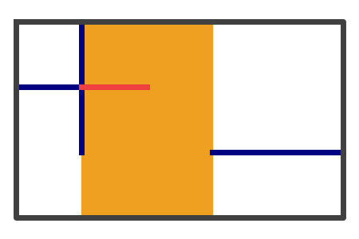

## Task 1

縦 R、横 C の長方形の紙があります。紙の左上隅から下に x (0 ≤ x ≤ R)、右に y (0 ≤ y ≤ C) 進んだ点を (x, y) とします。
紙には N 本の線分が引かれています。それぞれの線分は紙の縦軸または横軸に平行であり、i (1 ≤ i ≤ N) 番目の線分は (a<sub>i</sub>, b<sub>i</sub>) と (c<sub>i</sub>, d<sub>i</sub>) を両端点に持ちます。

Given a paper of length R in the vertical axis and C in the horizontal axis. We denote the origin (0, 0) as the upper-left corner of the paper. (x, y) represents a point going downwards by x (0 ≤ x ≤ R) and going rightwards by y (0 ≤ y ≤ C) from the origin. 
N line segments are drawn on the paper. Each line segment is parallel to either the paper's vertical or horizontal axis. The endpoints of the i-th (1 ≤ i ≤ N) line segment are (a<sub>i</sub>, b<sub>i</sub>) and (c<sub>i</sub>, d<sub>i</sub>).


この紙から、以下の条件をすべて満たすように長方形を切り出します。切り出せる最大の面積を求めてください。

- 切り出す長方形の縦軸、横軸はそれぞれ紙全体の縦軸、横軸と平行である
- どの線分についても、線分と切り出す長方形（周上を除く）が共有点を持たない。

Your task is to cut out a rectangle from the paper. Please calculate the largest area satisfying all of the following conditions.
- The cut-out rectangle's vertical and horizontal axes are parallel to those of the paper, respectively.
- No line segment, partially or entirely, overlaps with the INSIDE of the cut-out rectangle (line segments or endpoints can be on the edges of the cut-out rectangle).

例えば、図 1 のような切り出し方が条件を満たします。

For example, the cut-out rectangle shown in Fig. 1 satisfies all of the conditions.


図 1: 条件を満たす切り出しの例。黒い長方形とオレンジの長方形がそれぞれ紙と切り出す長方形を、青い線が紙に引かれた線分を表します。

Fig. 1: One of the possible cut-outs. The black and orange rectangles represent the paper and the cut-out rectangle, respectively, and the blue lines represent the line segments on the paper.

一方で、図 2 のようのような切り出し方の場合は、赤い線で示される領域において切り出す長方形と紙に引かれた線分が共有点を持ちます。

On the other hand, the cut-out rectangle shown in Fig. 2 has common points with line segments, represented by the red line. It is therefore not a valid rectangle.



図 2: 切り出す長方形と線分が共有点を持つ例。

Fig. 2: An example where the cut-out rectangle and the line segment overlap.

## 入力 / Input
以下のフォーマットの標準入力が与えられます。

The standard input format is as below:

R C<br>
N<br>
a<sub>1</sub> b<sub>1</sub> c<sub>1</sub> d<sub>1</sub><br>
:<br>
a<sub>N</sub> b<sub>N</sub> c<sub>N</sub> d<sub>N</sub><br>

制約は以下です。
- R, C は 1 以上 10<sup>9</sup> 以下の整数
- N は 1 以上 16 以下の整数
- a<sub>i</sub>, c<sub>i</sub> (1 ≤ i ≤ N) は 0 ≤ a<sub>i</sub> ≤ c<sub>i</sub> ≤ R を満たす整数
- b<sub>i</sub>, d<sub>i</sub> (1 ≤ i ≤ N) は 0 ≤ b<sub>i</sub> ≤ d<sub>i</sub> ≤ C を満たす整数
- すべての 1 ≤ i ≤ N に対し、以下のいずれかが成立する
  - a<sub>i</sub> = c<sub>i</sub> かつ b<sub>i</sub> < d<sub>i</sub>
  - a<sub>i</sub> < c<sub>i</sub> かつ b<sub>i</sub> = d<sub>i</sub>

Restrictions:
- R, C are integers satisfying 1 ≤ R ≤ 10<sup>9</sup> and 1 ≤ C ≤ 10<sup>9</sup>
- N is an integer satisfying 1 ≤ N ≤ 16
- a<sub>i</sub>, c<sub>i</sub> (1 ≤ i ≤ N) are integers satisfying 0 ≤ a<sub>i</sub> ≤ c<sub>i</sub> ≤ R
- b<sub>i</sub>, d<sub>i</sub> (1 ≤ i ≤ N) are integers satisfying 0 ≤ b<sub>i</sub> ≤ d<sub>i</sub> ≤ R
- One of the following conditions is satisfied for every 1 ≤ i ≤ N
  - a<sub>i</sub> = c<sub>i</sub> and b<sub>i</sub> < d<sub>i</sub>
  - a<sub>i</sub> < c<sub>i</sub> and b<sub>i</sub> = d<sub>i</sub>

## 出力 / Output
面積の最大値を標準出力に出力してください。

Write the largest area of the cut-out rectangle to its standard output.

## 入出力例 / Input & Output samples
### 例 1 / Sample 1
標準入力 / Sample Input
```plain
3 5
3
1 0 1 2
0 1 2 1
2 3 2 5
```
標準出力 / Sample Output
```plain
6
```
座標 (0, 2) を左上隅、座標 (2, 5) を右下隅とした面積 6 の長方形が条件を満たします。

The rectangle whose upper-left corner and lower-right corner are (0, 2) and (2, 5), respectively, satisfies all of the conditions.

### 例 2 / Sample 2
標準入力 / Sample Input
```plain
4 4
4
1 0 1 2
0 3 2 3
2 1 4 1
3 2 3 4
```
標準出力 / Sample Output
```plain
4
```

### 例 3 / Sample 3
標準入力 / Sample Input
```plain
1000000000 1000000000
1
0 0 0 1000000000
```
標準出力 / Sample Output
```plain
1000000000000000000
```
