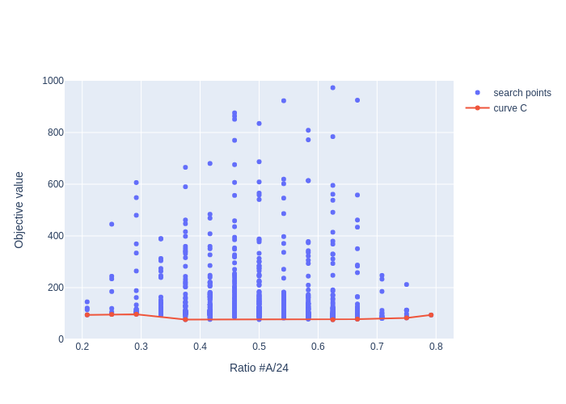
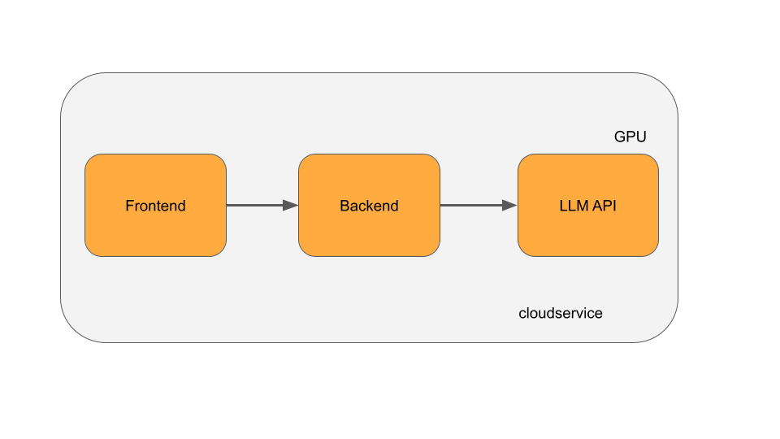

# Preferred Networks Internship 2023 Thematic Task

We question the understanding of the internship's thematic expertise.
Select a question corresponding to the theme of your first choice from the list below and submit your answer.

If the task is in a report format, please submit the answer in an A4 PDF with the file name `survey.pdf`.
Please follow the format specified in each question regarding page limits and format.
Unless otherwise specified, the number of pages is assumed to be no more than two including the reference section, and the format is assumed to be free.

If the task is not in a report format, please submit the answer following the format specified in each question.
If the specified format is `zip`, please submit the answer with the file name `survey.zip`.

### Notice

Please carefully review the information provided in the email message to which this assignment was attached.

Please do the task yourself. Do not share or discuss this task with anyone, including other applicants.
**Do not upload your solution and/or problem description to a public repository on GitHub or social networking sites.**
(After the screening period finished, we may publish the problem statement on GitHub. If so, you may share your solution with others, limited to the tasks that are disclosed in the publication.)
If we find evidence of leakage, the applicant will be disqualified. If an applicant allows another applicant to copy answers, both applicants will be disqualified.

We expect the coding task and the thematic task to take up to two days. You can submit your completed work without solving all of the problems. Please do your best without neglecting your coursework.

Any intellectual property resulting from your internship program will belong to PFN.
**When you select an intern theme topic, please be careful not to bring in your research themes, ideas, and so on at your university and/or institution.**

The thematic assignment will assess your understanding of the knowledge and techniques involved in the intern theme.
When answering the thematic assignment questions, **it is important that you do not include any patentable ideas such as unpublished research results or original problem-solving ideas in your submission (such as a report)** in order to avoid conflicts regarding the attribution of inventions.


### How to submit

Submit your answer on this form (https://forms.gle/x5z6GdhTvu3WE6jY8).
The due date is **Sunday, May 7, 2023, 23:59 Japan Standard Time**.
Please submit your application in plenty of time.

### Inquiry

If you have any questions on this problem description, please contact us at intern2023-admin@preferred.jp. An updated version will be shared with all applicants if any change is made. Note that we cannot comment on the approach or give hints to the solution.

<div style="page-break-before:always"></div>

## 1. Development of training methods for large-scale language models

Select one paper from the following list, and write a hypothetical peer-review report. 

* Dao, T., Fu, D.Y., Ermon, S., Rudra, A., & R'e, C. (2022). FlashAttention: Fast and Memory-Efficient Exact Attention with IO-Awareness. ArXiv, abs/2205.14135.
  + https://arxiv.org/abs/2205.14135 
* Narayanan, D., Shoeybi, M., Casper, J., LeGresley, P., Patwary, M., Korthikanti, V.A., Vainbrand, D., Kashinkunti, P., Bernauer, J., Catanzaro, B., Phanishayee, A., & Zaharia, M.A. (2021). Efficient Large-Scale Language Model Training on GPU Clusters Using Megatron-LM. SC21: International Conference for High Performance Computing, Networking, Storage and Analysis, 1-14.
  + https://dl.acm.org/doi/10.1145/3458817.3476209 
* Sheng, Y., Zheng, L., Yuan, B., Li, Z., Ryabinin, M., Fu, D.Y., Xie, Z., Chen, B., Barrett, C.W., Gonzalez, J., Liang, P., Ré, C., Stoica, I.C., & Zhang, C. (2023). High-throughput Generative Inference of Large Language Models with a Single GPU. ArXiv, abs/2303.06865.
  + https://arxiv.org/abs/2303.06865 

The report should includes the following items: 
* Title of the paper
* A summary of the paper's content
* Strong points of this paper/research, minimum 1 point, maximum 3 points
* Weak points of this paper/research, minimum 1 point, maximum 3 points

In your answers, do not include any improvements or innovations that can bring a sense of novelty to the paper.

### Length of your report
Submit your report in A4-sized PDF within 2 pages. 

<div style="page-break-before:always"></div>

## 8. Development MN-Core compiler and toolchain

Please select and answer only one of the following questions.
- Theme 9: Development of framework and library for deploying deep learning models in real world
- Theme 10: Development of CuPy

<div style="page-break-before:always"></div>

## 9. Development of framework and library for deploying deep learning models in real world

Answer the following questions about computation graph with operation nodes and its inputs and outputs. 

### Q1.
Represent a computation graph in pseudo code for deep learning like ONNX using a programming language without GC like C++ or Rust. Computation graph is a static single assignment formed with operation nodes(`Node`), connections of each node(`Value`), and a `Graph` holds `Node`s with an executable order. You could use a reference counted type(like std::shared_ptr/std::rc::Rc), a uniquely reference type(like std::unique_ptr/std::boxed::Box), a unowned pointer type(like std::weak_ptr or raw pointer type/std::rc::Weak or reference type). Also `Node` holds an operator name with string type.

### Q2.
Write a pseudo code to remove an operation node with 1 input, 1 output, named  “NOP” from a graph defined in Q1. After graph conversion memory leaks or pointer dangles must not happen.

### Q3.
Write a pseudo code to add an operation node with 1 input, 1 output, named  “NOP” after the output of an operator node named “opA” which has 1 output in a graph defined in Q1. After graph conversion memory leaks or pointer dangles must not happen.

### Q4.
Estimate the memory consumption of graph execution by given order when size of input and each `Value`s is provided. You could freely define how memories are allocated and deallocated.

### Submission
Submit followings in the single zip file
- Report in about 2 sheets of A4 paper
- (Optional) Appendix source codes that you wrote for additional material or verification of report

<div style="page-break-before:always"></div>

## 10. Development of CuPy

Please answer the following two tasks.
Note that your answers should not contain any novel contents that are not published yet and are potentially patent-able. 

### Problem 1. Comparison between CPU and GPU algorithms
We have n intervals in one-dimensional space, each interval is defined by a pair of values for the start and end. There are nC2 combinations to choose two of these intervals, and we want to find the number of combinations where there is no overlap between any pair of intervals. If we want to solve this problem efficiently on an execution environment which has a GPU, should we write this program using CUDA?

Please implement the program with and without CUDA using C++. Also, compare the performance of both programs and describe the methodology used for it. If needed, you can use any of the standard libraries in CUDA (including Thrust, CUB), but the use of other libraries is not allowed.

### Problem 2. NumPy Quiz
For all quizzes below, implement a Python code using NumPy according to the following specifications. Please note that, any reference to “tensor” below  means NumPy’s ndarray.

1. Given two one-dimensional tensors `a` and `b`, find a two-dimensional tensor `c` such that `c[i, j] = a[i] + b[j]` .
2. Let n be an integer greater than or equal to 1. Given a two-dimensional tensor x with shape (2, n), find the result of rearranging `x[0]` in the ascending order of `x[1]`.
3. Given a one-dimensional tensor x where some of the elements are set to `np.nan`. Replace these elements with the linear interpolation of the nearest non-nan values without `np.interp`. You can assume that the leftmost and rightmost values are not nan.
4. Given two two-dimensional tensors `a` and `b` with the same shape, rewrite the following code without `for` statements.
```py
n = len(b)
res = np.zeros_like(a)
for i in range(n):
    res += (a == b[i]) * (i + 1)
```

### Submissions
Please include the following files in a single zip.
- The implementation for Problem 1.
  * A function that computes the modal value of the input array
  * Your execution environment information
  * The command line used to compile the sources
  * Tests to verify the validity of the output values
  * Add the minimal required comments in the code for readability.
- The report for Problem 1.
  * The report should contain 2 pages of A4 size paper.
  * Please describe your idea and performance evaluation.
- The implementation for Problem 2.
  * Python codes in py or ipynb format
  * Your execution environment information
  * Tests to verify the validity of output values
  * Add the minimal required comments in the code for readability.

<div style="page-break-before:always"></div>

## 11. Development of Optuna and Optuna Dashboard

### Basic Task

Explain the ROC curve used to evaluate the binary classification, including at least the following items

* Meaning of the horizontal and vertical axes
* Plotting method and shape of the curve
* Value ranges of AUC values and how to interpret them

Please explain in detail, using figures, tables, and equations as necessary. Also, please cite appropriately any references used in the survey.

### Advanced Task (Optional question; plus if you answer)

Optuna is a black-box optimization library that allows you to define a search space that depends on the suggested variable through define-by-run API. For example, as the following code snippet shows, the regression model to be used changes depending on the value of `regressor_name` variable, which can be written easily using if statements. On the other hand, some algorithms, such as Bayesian optimization based on Gaussian processes, can capture correlations between variables by defining the search space in advance in a define-and-run manner.

```python
def objective(trial):
    regressor_name = trial.suggest_categorical('regressor_name', ['SVR', 'RandomForest'])
    if regressor_name == 'SVR':
        svr_c = trial.suggest_float('svr_c', 1e-10, 1e10, log=True)
        regressor_obj = sklearn.svm.SVR(C=svr_c)
    else:
        rf_max_depth = trial.suggest_int('rf_max_depth', 2, 32)
        regressor_obj = sklearn.ensemble.RandomForestRegressor(max_depth=rf_max_depth)
    ...
```

Please explain the need and role of BaseSampler.sample_independent and BaseSampler.sample_relative from the perspective of a mechanism for define-by-run and define-and-run to coexist after reading [this document](https://optuna.readthedocs.io/en/stable/reference/samplers/generated/optuna.samplers.BaseSampler.html) and Optuna's source code. 

### length of the report

Submit your report in a A4-sized PDF within 2 pages. 

<div style="page-break-before:always"></div>

## 12. Crystal structure prediction using Matlantis and Optuna

### Basic Research Questions
Please answer the following two questions:

(1) Explain the visualization of the Pareto front used in the analysis of multi-objective optimization problems, including at least the following items:
- Purpose and overview of the plot
- Relationship between Pareto and non-Pareto solutions
- Approximation methods and plot methods

If necessary, provide definitions of terms and explain in detail using figures, tables, equations, and appropriate citations. Please aim for about half a page of explanation on an A4 sheet.

(2) Explain the phase diagram used in the analysis of crystal structure exploration, including at least the following items:
- Purpose and overview of the plot
- Distribution of stable and metastable structures
- Meaning of the convex hull
- Approximation methods and plot methods

If necessary, provide definitions of terms and explain in detail using figures, tables, equations, and appropriate citations. Please refer to the [ASE tutorial](https://wiki.fysik.dtu.dk/ase/tutorials/ga/ga_convex_hull.html) for your research. Please aim for about half a page of explanation on an A4 sheet.

### Applied Research Questions
Consider a method for solving the following optimization problem. Please aim for about one page of explanation of the method, and you will receive extra points if you create a program to implement the method using Python.

#### Problem
Twenty-four points of two types, A and B, will be placed in three-dimensional space. The number of A's and B's can vary, and the points cannot overlap. The function that returns a scalar value for this arrangement is defined as the objective function f(x). The curve C is defined so that it becomes "better" in the following way with respect to the output of the objective function f.

Consider a two-dimensional graph that takes the ratio of the number of A points to the total number of points (= 24) on the horizontal axis and the value of the objective function on the vertical axis (see the figure below). For an arrangement x of A's and B's, the ratio of the number of A points to the total number of points (= 24) is determined as a real-valued function r(x) (a real number between 0 and 1). The pair (x, f(x)) of an arrangement x and its evaluation of the objective function is associated with a point (r(x), f(x)) on this two-dimensional graph. The set of points {(r(x_i), f(x_i))} determined by multiple pairs {(x_i, f(x_i))} searched for in optimization is considered, and the lower curve of the convex hull of these points is defined as C. On the other hand, the lower curve of the convex hull of the set of points {(r(x), f(x))} determined by all arrangements of A and B and their objective function pairs {(x, f(x))} is defined as C^*. C is obtained by the optimization algorithm, but C^* is unknown. C is considered "better" when it is closer to C^*. However, since C^* is unknown, the optimality of C, i.e., that it is equal to C^*, cannot be proved.

This task is modeled after the problem of crystal structure prediction. By considering points A and B as atoms and scalar values as energy, we can consider the problem of finding the arrangement of atoms that is low in energy and stable, which corresponds to the structure of a crystal, for various compositions (= ratios of the number of A). Note that there is no need to spend time developing a highly optimized optimization algorithm for this task. Instead, please focus on creating a clear algorithm and explaining its motivation.

#### Objective function
Assuming that the objective function is defined using the function `Objective.__call__` in the Python atomic simulation library ASE v3.22.1 (as of April 11, 2023), the following code represents the objective function. Please do not change the definition of this objective function.

```python
from __future__ import annotations

from collections import defaultdict
from ase import Atoms
from ase.calculators.emt import EMT
import numpy as np
import plotly.graph_objects as go
import random
from scipy.spatial import ConvexHull


N_ATOMS = 24
INF = 1e+10


class Objective:
    def __init__(self) -> None:
        pass

    def __call__(self, x: tuple[list[str], list[list[float]]]) -> float:
        atom_type = x[0]
        positions = x[1]

        atoms = Atoms(
            numbers=[self._char2number(c) for c in atom_type],
            positions=positions,
        )
        atoms.calc = EMT()
        e = atoms.get_potential_energy()
        return e

    @staticmethod
    def _char2number(c: str) -> int:
        return 29 if c == 'A' else 78
```

#### Curve
The following program outputs the curve C for the pairs of arrangements and the corresponding evaluation values of the objective function obtained during optimization. Feel free to modify the program to make the analysis results more understandable.

```python
def plot_result(xs: list[tuple[list[str], list[list[float]]]], ys: list[float]) -> go.Figure:
    layout = go.Layout(
        xaxis={"title": "Ratio #A/24"},
        yaxis={"title": "Objective value", "range": [0, 1000]},
    )

    ratios = []
    for x in xs:
        ratios.append(x[0].count('A') / N_ATOMS)

    ratio_to_miny = defaultdict(lambda: INF)
    for ratio, y in zip(ratios, ys):
        ratio_to_miny[ratio] = min(ratio_to_miny[ratio], y)
    points = []
    for ratio, miny in ratio_to_miny.items():
        points.append([ratio, miny])
    points = np.asarray(points)
    hull = ConvexHull(points)
    curveC = points[hull.vertices]
    curveC = curveC[np.argsort(curveC[:, 0])]

    traces = []
    traces.append(go.Scatter(x=ratios, y=ys, mode="markers", name="search points"))
    traces.append(go.Scatter(x=curveC[:, 0], y=curveC[:, 1], name="curve C"))

    return go.Figure(data=traces, layout=layout)

```

#### Baseline:
As a baseline for the algorithm, the following program generates 1000 arrangements randomly, evaluates them with the objective function, and outputs curve C and `plot.png`.

```python
xs = []
for _ in range(1000):
    atom_type = ['A' if random.random() >= 0.5 else 'B' for _ in range(24)]
    positions = [[random.uniform(0, 20) for _ in range(3)] for _ in range(24)]
    xs.append((atom_type, positions))

objective = Objective()
ys = [objective(x) for x in xs]

fig = plot_result(xs, ys)
fig.write_image("plot.png")

```




### submission
Bundle the materials below into a single ZIP file. 
- Report of the Basic Reserach Question
- Report of the Applied Research Question
- Program sources of the implmentation of the Applied Reerach Question (if any)

<div style="page-break-before:always"></div>

## 13. Research and Development for material discovery algorithms in Matlantis
### Basic Task
Summarize the technical characteristics of [Matlantis](https://matlantis.com/), and list more than two benefits and disadvantages, respectively. 
Answer in a PDF file of A4-size, within two pages. 

### Advanced Task
Please see `theme13/JE13_task-en.ipynb`.

### Submission
Bundle the PDF of the basic task and the outputs of the advanced task and compress them by zip. Submit the resultant zip file. 

<div style="page-break-before:always"></div>

## 14. Development and operation of a web system for Matlantis which is a general-purpose atomic-level simulator

### Prerequisite, Requirements
You are trying to provide a SaaS, chat-style article search service using LLMs that you have created yourself. You have decided to design the system as shown in the following diagram.


The LLM you created has the following characteristics: it requires one GPU to run the LLM. Suppose there are two types of GPUs: high-end and low-end. If you run LLM on a high-end GPU, the latency to generate results will be shorter. If a low-end GPU is used, it will basically take a long time to generate the results. This LLM model also allows you to combine multiple inputs and infer in batch. Also, you update the model at least once a month.
You plan to use cloud service A to deploy this system. This cloud service A offers instances of both high-end and low-end GPUs, with the high-end GPUs being more expensive and not always in stock, while the low-end GPUs are less expensive and always in stock.
Now suppose also that the following characteristics appear in the access pattern to this service. The LLM you created is so good that it sometimes gets buzzed on twitter. Therefore, the number of requests may suddenly increase at unexpected times. However, since the service is only popular in Japan, the number of requests late at night Japan time is always low.


### Assignment
If you are participating in the development of this SaaS, please compose a report on one or more areas of front-end, back-end, or infrastructure that you feel are important to your implementation. You do not need to write about all areas. Please summarize your areas of expertise. We will give you more points if you write comments in broader area. **We will give you extra points if you clearly describe specific libraries or services that are necessary for your implementation.**

Examples
* UI / Frontend
    * How to provide multiple model versions
    * How to reduce (experience) time for response generation
    * How to receive real-time chat data
    * How to distribute real-time chat data
* Backend
    * How real-time chat data will be delivered
    * Hosting Methods
    * What API protocols will be used
    * How to mix and match multiple GPU types.
* Infrastructure
    * How to avoid incident when updating the model.
    * How to scale API backend
    * How to save on infrastructure costs
* Others
    * Security
    * Billing models

Any other issues that are not mentioned above. You may write about other points as well.
You do not have to fulfill all of the requirements.

### Length of the report
Submit your report as a A4-sized PDF within 2 pages. 

<div style="page-break-before:always"></div>

## 15. Applied research and development of machine learning and atomic simulation on materials

Please submit a 1-2 page A4 size equivalent PDF summarizing your responses to the following

### Basic Research Question
Identify one paper on a topic related to both atomic simulation and machine learning and summarize it from the following perspectives You may assume that the reader has a basic knowledge of the field.

- Paper title
- Summary of the paper
- The superiority of the paper over the previous studies cited in the paper, at least 1, up to 3 
- The reason why the paper has its superiority

For the selection of the paper, if you have an issue that you intend to work on in this internship, please use the relevant paper. If you do not yet have a firm topic in mind, you may choose a paper from the following list.

If you find it easier to work on the task of "Development and operation of a web system for Matlantis which is a general-purpose atomic-level simulator" rather than this task, you may work on that one instead.

#### Paper list
- D. Pfau, J. S. Spencer, A. G. D. G. Matthews, and W. M. C. Foulkes, Ab Initio Solution of the Many-Electron Schr"odinger Equation with Deep Neural Networks, Phys. Rev. Research 2, 033429 (2020). https://journals.aps.org/prresearch/abstract/10.1103/PhysRevResearch.2.033429
- H. Li, Z. Wang, N. Zou, M. Ye, R. Xu, X. Gong, W. Duan, and Y. Xu, Deep-Learning Density Functional Theory Hamiltonian for Efficient Ab Initio Electronic-Structure Calculation, Nature Computational Science 2, 367 (2022). https://www.nature.com/articles/s43588-022-00265-6 (https://arxiv.org/abs/2104.03786)
- K. Shimizu, Y. Dou, E. F. Arguelles, T. Moriya, E. Minamitani, and S. Watanabe, Using Neural Network Potentials to Study Defect Formation and Phonon Properties of Nitrogen Vacancies with Multiple Charge States in GaN, Phys. Rev. B Condens. Matter 106, (2022). https://journals.aps.org/prb/abstract/10.1103/PhysRevB.106.054108 (https://arxiv.org/abs/2203.16789)
- M. Cools-Ceuppens, J. Dambre, and T. Verstraelen, Modeling Electronic Response Properties with an Explicit-Electron Machine Learning Potential, J. Chem. Theory Comput. 18, 1672 (2022).
https://pubs.acs.org/doi/abs/10.1021/acs.jctc.1c00978
- S. Batzner, A. Musaelian, L. Sun, M. Geiger, J. P. Mailoa, M. Kornbluth, N. Molinari, T. E. Smidt & B. Kozinsky, E(3)-equivariant graph neural networks for data-efficient and accurate interatomic potentials, Nat Commun 13, 2453 (2022). https://www.nature.com/articles/s41467-022-29939-5
- M. Xu, L. Yu, Y. Song, C. Shi, S. Ermon, J. Tang, GeoDiff: A Geometric Diffusion Model for Molecular Conformation Generation, The International Conference on Learning Representations (ICLR) 2022. https://openreview.net/forum?id=PzcvxEMzvQC
- C. Chen, S. P. Ong, A universal graph deep learning interatomic potential for the periodic table, Nat Comput Sci 2, 718–728 (2022). https://www.nature.com/articles/s43588-022-00349-3 (https://arxiv.org/abs/2202.02450)
- J. Kirkpatrick, et al. Pushing the frontiers of density functionals by solving the fractional electron problem. Science 374.6573 (2021). https://www.science.org/doi/10.1126/science.abj6511

### Applied Descriptive Question 1
Consider checking for yourself whether the advantages described above are really the performance claimed in the paper. Plan to do some additional verification work by actually comparing the methods in the paper with those in prior studies. At this point, what kind of experiments and verifications would confirm the superiority? Choose one of the advantages summarized above and write a description of the verification workflow to be performed.

### Applied Descriptive Question 2 [optional]
Think about the details of the verification work. What do you imagine that we should be careful about at that time, what parts of the implementation are unclear in the paper, and what parts seem to be technically difficult or need to be devised? Please list some perspectives you can think of. Please note that this is only a discussion for the faithful implementation of the paper, and do not consider devices such as proposals for approximate calculations that can be separately claimed as novelty.

<div style="page-break-before:always"></div>

## 18. Development of training methods for models using gene-related graphs

### Basic Task (Mandatory)

Explain the ROC curve used to evaluate the binary classification, including at least the following items

- Meaning of the horizontal and vertical axes
- Plotting method and shape of the curve
- Value ranges of AUC values and how to interpret them

Please explain in detail, using figures, tables, and equations as necessary. Also, please cite appropriately any references used in the survey.

### Advanced Task (Optional)

You have purchase data for N=1,000 customers and M=100,000 products. You have been asked to use this data to create a predictive model of customer buying behavior. The characteristics of the data are as follows:

- The data are purchase data from an online bookstore
- The main data D is an N x M matrix (table data)
- The (n, m)-th element of the matrix represents the number of purchases of product m by customer ID n: D(n,m) = d (d is a non-negative integer) 
- Attribute data x_n, y_m exist for each customer and product.
  - Age, gender, and address (up to prefecture) are registered as customer attributes. However, some data are missing.
  - As product attributes, author and publisher are always registered, and reviews are registered only for some products.

The purpose of this project is to use this data to find prospective users who can become new customers. For this purpose, you are to create a model to predict the item purchase probability for new customers.

Please provide a comprehensive discussion of the elements that you believe need to be considered and verified in order to realize such a predictive model. In particular, please be sure to provide input on the following elements:

- Data Characteristics
  - Sparsity
  - Customer/product group
- Performance evaluation method
  - Split method to train/val/test
  - Prediction accuracy evaluation method
- Appropriate model

However, in addition to the conditions mentioned above, there must be other conditions that should be considered, although they have not yet become apparent. Please think and assume about them yourself and include them in the discussion.

### Length of the report
Submit your answers by an A4-sized PDF within 2 pages. 

<div style="page-break-before:always"></div>

## 19. Application of deep tabular models to healthcare

### Basic Task (Mandatory)

Explain the ROC curve used to evaluate the binary classification, including at least the following items

- Meaning of the horizontal and vertical axes
- Plotting method and shape of the curve
- Value ranges of AUC values and how to interpret them

Please explain in detail, using figures, tables, and equations as necessary. Also, please cite appropriately any references used in the survey.

### Advanced Task (Optional)

You have purchase data for N=1,000 customers and M=100,000 products. You have been asked to use this data to create a predictive model of customer buying behavior. The characteristics of the data are as follows:

- The data are purchase data from an online bookstore
- The main data D is an N x M matrix (table data)
- The (n, m)-th element of the matrix represents the number of purchases of product m by customer ID n: D(n,m) = d (d is a non-negative integer) 
- Attribute data x_n, y_m exist for each customer and product.
  - Age, gender, and address (up to prefecture) are registered as customer attributes. However, some data are missing.
  - As product attributes, author and publisher are always registered, and reviews are registered only for some products.

The purpose of this project is to use this data to find prospective users who can become new customers. For this purpose, you are to create a model to predict the item purchase probability for new customers.

Please provide a comprehensive discussion of the elements that you believe need to be considered and verified in order to realize such a predictive model. In particular, please be sure to provide input on the following elements:

- Data Characteristics
  - Sparsity
  - Customer/product group
- Performance evaluation method
  - Split method to train/val/test
  - Prediction accuracy evaluation method
- Appropriate model

However, in addition to the conditions mentioned above, there must be other conditions that should be considered, although they have not yet become apparent. Please think and assume about them yourself and include them in the discussion.

### Length of the report

Summarize your report to a A4-sized PDF within 2 pages. 

<div style="page-break-before:always"></div>

## 22. Research on machine learning methods for medical imaging

Select one paper from the list below and write a review report of the paper. Make sure to appropriately cite all relevant prior research as supporting evidence. Please include the following in the review report. 
- Title of the paper
- A summary of the paper's content
- Strong points of this paper/research, minimum 1 point, maximum 3 points
- Weak points of this paper/research, minimum 2 points, maximum 3 points

When writing the review report, please do not refer to reports from OpenReview or other sources. If plagiarism is detected, points will be deducted.
In your answers, do not include any improvements or innovations that can bring a sense of novelty to the paper.

Lists of papers
- “Medical Diffusion: Denoising Diffusion Probabilistic Models for 3D Medical Image Generation”, https://arxiv.org/abs/2211.03364
- “CLIP-Driven Universal Model for Organ Segmentation and Tumor Detection”, https://arxiv.org/abs/2301.00785
- “Learning to Exploit Temporal Structure for Biomedical Vision-Language Processing”, https://arxiv.org/abs/2301.04558 
- “Universal Few-shot Learning of Dense Prediction Tasks with Visual Token Matching”, https://arxiv.org/abs/2303.14969 
- “Segment Anything”, https://arxiv.org/abs/2304.02643 
- You may select a different paper from MICCAI2022, NeurIPS2022, ICML2022, ICLR2022/2023, CVPR2022 as long as it relates to medical imaging, or can be applied to medical imaging.

Submit your review report in a A4-sized PDF within 2 pages. 

<div style="page-break-before:always"></div>

## 26. Designing and Implementing Application of AI-Generated Content.

Pick one service (excluding services of our company) that employs generative AI (image generation, large language models, voice synthesis, etc.), and write a report that analyzes the service and proposes an improvement plan.
Please do not include any novel (potentially patent-able) contents in  your report: e.g. adding a new feature, updating the existing feature, 

### Assignment ① Analyze the service

Analyze the service you have chosen from several different angles.

* Applications (front-end, back-end, security)
* System (system design, infrastructure, GPU cluster)
* UI/UX (usability, design, accessibility)
* Product analysis (use cases, target users, revenue model, community strategy)

Points:
1. The above is an example list of perspectives for your analysis. You are free to analyze from any perspective. 
2. Please indicate the source of your citation when citing publicly available information on the service that is either official of unofficial.
3. Rather than covering all aspects, it is better to focus your analysis on aspects of particular interest to you.

### Assignment ② Proposals for improvement of the service

Based on your answer to Assignment ①, propose an improvement plan to make the service better. 

### Submission

Please submit the answers to Task ① and Task ② as a single PDF file within two A4-sized pages. There is no restriction to the format of your writing.
If you create source code, system diagrams, UI design, product design diagrams, etc., please include them in the PDF. 
You may submit a zip file that combines the PDF report and other files if absolutely necessary.

<div style="page-break-before:always"></div>

## 27. Application of deep learning techniques to creation

### Task ①
Choose a paper related to the application of deep learning techniques to creation, and create a hypothetical peer-review report. Please include the following content in the report:

- Paper Title
- Summary of the paper's content
- Strengths of the paper/research (1-3 points)
- Weaknesses of the paper/research (1-3 points)

### Task ②
Next, consider actually implementing the approach proposed in this paper. List the points to consider, ambiguous aspects in the paper, and technical challenges. 
However, the discussion should be solely for the faithful implementation of the paper. Therefore, **do not include any *innovative ideas or approaches* that can claim novelty on their own** in the report.

### Guideline to the Tasks

We recommend choosing a paper published at one of the following international conferences no earlier than 2022:

- CVPR / ICCV / ECCV
- SIGGRAPH / SIGGRAPH Asia

You can also select papers not on the list or on Arxiv only. In that case, explain the reason for your selection and how you would like to utilize it to solve practical problems related to creation.

Please cite prior research and other evidence appropriately in your evaluation.

Please submit the answers to Task ① and Task ② as a single PDF file within two A4-sized pages. There is no restriction to the format of your writing.

<div style="page-break-before:always"></div>

## 36. Autonomous driving system for trucks. Development of perception modules such as 3D object detection.

### Basic task
Select a paper that you find interesting related to 3D object detection accepted to CVPR 2023 and write a peer review of the paper.
Please follow the [CVPR reviewer guidelines](https://cvpr2023.thecvf.com/Conferences/2023/ReviewerGuidelines).

In your answers, do not include any improvements or innovations that can bring a sense of novelty to the paper.

### Length of the report
Answer to the tasks and submit your report as a A4-sized PDF with at most 2 pages.  

<div style="page-break-before:always"></div>

## 42. Research and development on the estimation/prediction of various weather conditions using the advanced high-spatio-temporal resolution 3D weather data

Write a review report of a paper listed below. Appropriately cite the reference papers when you need. The report should include the following items. 
- Title
- Summary
- Strong points of the paper (min. 1 item, max. 3 items)
- Weak points of the paper (min. 1 item, max. 3 items)

In your answers, do not include any improvements or innovations that can bring a sense of novelty to the paper.

### Lists of papers

- "ClimaX: A foundation model for weather and climate" http://arxiv.org/abs/2301.10343
- "WF-UNet: Weather Fusion UNet for Precipitation Nowcasting"  https://arxiv.org/abs/2302.04102
- "FourCastNet: A Global Data-driven High-resolution Weather Model using Adaptive Fourier Neural Operators"　http://arxiv.org/abs/2202.11214
- "WeatherFusionNet: Predicting Precipitation from Satellite Data"	https://arxiv.org/abs/2211.16824
- "Earthformer: Exploring Space-Time Transformers for Earth System Forecasting" https://proceedings.neurips.cc/paper_files/paper/2022/hash/a2affd71d15e8fedffe18d0219f4837a-Abstract-Conference.html	
- "MetNet: A Neural Weather Model for Precipitation Forecasting" https://arxiv.org/abs/2005.08748
- "PredRNN: Recurrent Neural Networks for Predictive Learning using Spatiotemporal LSTMs" https://proceedings.neurips.cc/paper/2017/hash/e5f6ad6ce374177eef023bf5d0c018b6-Abstract.html
- "Disentangling Physical Dynamics from Unknown Factors for Unsupervised Video Prediction" https://openaccess.thecvf.com/content_CVPR_2020/papers/Le_Guen_Disentangling_Physical_Dynamics_From_Unknown_Factors_for_Unsupervised_Video_Prediction_CVPR_2020_paper.pdf							

### Length of your report
Report by an A4-sized PDF within 2 pages. 

<div style="page-break-before:always"></div>

## 43. Research and development of advanced segmentation techniques for SAR image data

Write a hypothetical review report of a semantic segmentation paper of SAR data listed below, which are chosen from IEEE IGARSS 2021/2022. Appropriately cite the reference papers when you need.
- title
- summary
- Strong points of the paper (min. 1 item, max. 3 items)
- Weak points of the paper (min. 1 item, max. 3 items)

In your answers, do not include any improvements or innovations that can bring a sense of novelty to the paper.

[Lists of papers] 
- **Semi-Supervised Semantic Segmentation of SAR Images Based on Cross Pseudo-Supervision**, Haibo Zhang; Hanyu Hong; Ying Zhu; Yaozong Zhang; Pengtian Wang; Lei Wang, IGARSS 2022
- **Land Cover Semantic Segmentation of High-Resolution Gaofen-3 SAR Image**, Xianzheng Shi; Feng Xu, 2021 IEEE International Geoscience and Remote Sensing Symposium IGARSS
- **A Novel Deep Transfer Learning Method for SAR and Optical Fusion Imagery Semantic Segmentation**, Yanjuan Liu;Yingying Kong, 2021 IEEE International Geoscience and Remote Sensing Symposium IGARSS
- **A Dual-Fusion Semantic Segmentation Framework with Gan for SAR Images**, Donghui Li; Jia Liu; Fang Liu;Wenhua Zhang;Andi Zhang;Wenfei Gao; Jiao Shi, IGARSS 2022
- **Semantic Segmentation of SAR Images Through Fully Convolutional Networks and Hierarchical Probabilistic Graphical Models**, Martina Pastorino; Gabriele Moser; Sebastiano B. Serpico; Josiane Zerubia, IGARSS 2022
- **Semantic Segmentation of Land Use / Land Cover (LU/LC) Types Using F-CNNS on Multi-Sensor (Radar-Ir-Optical) Image Data**, Usman Iqbal Ahmed; Arturo Velasco; Bernhard Rabus, 2021 IEEE International Geoscience and Remote Sensing Symposium IGARSS
- **Assessing Buildings Damage from Multi-Temporal Sar Images Fusion using Semantic Change Detection**, Lei Pang; Fengli Zhang; Lu Li; Qiqi Huang; Yanan Jiao; Yun Shao, IGARSS 2022
- **Extraction of Floating Raft Aquaculture Areas from Sentinel-1 SAR Images by a Dense Residual U-Net Model with Pre-Trained ResNet34 as the Encoder**, Long Gao; Hongbo Su; Chengyi Wang; Kai Liu; Shaohui Chen, IGARSS 2022
- **The SpaceNet 8 Challenge - From Foundation Mapping to Flood Detection**, Ronny Hänsch; Jacob Arndt; Matthew Gibb; Arnold Boedihardjo; Tyler Pedelose; Todd M. Bacastow, IGARSS 2022

[ Length of the report ] Submit the report within 2 pages of A4-sized PDF document. 

<div style="page-break-before:always"></div>

## 45. Basic research to introduce structural induction bias into diffusion models

Please read the gDDIM paper(https://arxiv.org/abs/2206.05564) .
After reading the paper, please write a report answering the following requests:
- Please describe the main theorems presented in this paper while using as little jargons as possible, along with the dependencies amongst them.

- Please give us your interpretation of this paper’s claim on how the difference between DDIM and DDPM comes about.

- If you were to add more experiments to this paper, what experiments would you run for what purpose? Please briefly explain.
	      Please make an effort to contain the paper within 2pages limit with usual Conference paper format.

Your report should be an A4 PDF document within 2 pages. 

<div style="page-break-before:always"></div>

## 46. Symmetry-based 3D representation learning and its computer vision applications

Write your response for both tasks within the range of two A4 pages (800 words), as a PDF file.

### Problem 1
You are a reviewer for an international conference. Choose one paper from the list below and create a hypothetical review report. Be sure to include the following information in your report:

- Paper title
- Summary of the paper's content
- Strong points of the paper, at least 1, up to 3
- Weak points of the paper, at least 1, up to 3

In your answers, do not include any improvements or innovations that can bring a sense of novelty to the paper.

paper list:
- Liu, R., Wu, R., Van Hoorick, B., Tokmakov, P., Zakharov, S., & Vondrick, C. (2023). **Zero-1-to-3: Zero-shot One Image to 3D Object**. arXiv preprint arXiv:2303.11328.
- Miyato, T., Koyama, M., & Fukumizu, K. (2022). **Unsupervised Learning of Equivariant Structure from Sequences**. arXiv preprint arXiv:2210.05972.
- Biza, O., van Steenkiste, S., Sajjadi, M. S., Elsayed, G. F., Mahendran, A., & Kipf, T. (2023). **Invariant Slot Attention: Object Discovery with Slot-Centric Reference Frames**. arXiv preprint arXiv:2302.04973.


### Problem 2
Please introduce an interesting paper you have recently read. Write your explanation in a way that is easy to understand for someone who is not familiar with the field (imagine explaining it to a fourth-year undergraduate student in science or engineering). Any paper that is freely available on the internet is acceptable. Your report should include the following information:

- Title and URL of the paper
- Summary of the paper's content
- How you came to know about the paper
- Time it took to read the paper
- Interesting points you found and an explanation of why you found them interesting
- Any parts that were difficult to understand (if any)

<div style="page-break-before:always"></div>

## 47. Interactive System for 3D/4D reconstruction

In your answers, do not include any improvements or innovations that can bring a sense of novelty to the paper.

### Task 1
Please outline the research and development projects you have worked on in the following areas (300 - 600
words, 1 or 2 figures)
areas: Human-Computer Interaction, Computer Graphics, Visualization, Machine Learning, Computer Vision, Accessibility, Information Retrieval

### Task 2
Please select and answer one from the following 1. 2. (400-800 words). Please insert appropriate citations and figures as necessary.
For Task  2, you can use large language models (LLMs) such as ChatGPT to answer the questions. If you use them, please briefly summarize how you utilized them and what kind of improvements you made to the prompts.

1. please select a paper about 3D/4D reconstruction with a HCI approach from the following conferences and answer Q1-Q5
below.<br>
Conference: CHI2020-2023, UIST2020-2022, IUI2020-2023, SIGGRAPH2020-2022, SIGGRAPH Asia2020-2022, IEEE VR2020-2023, ISMAR2020-2023

Q1 Why the HCI approach is necessary for the problem this research addresses?<br>
Q2 What problem does the paper solve?<br>
Q3 How does the paper solve the problem, and what are its features?<br>
Q4 In what cases does the method work well, and in what cases does it not work well?<br>
Q5 What are the inadequacies of this paper? What is the cause of the inadequacies?<br>

2. please answer the following Q1-2

Q1 How do you think HCI can contribute to 3D/4D reconstruction tasks? Please give at least three
examples.
Q2 Please select one 3D/4D reconstruction task and explain its dificulties and several methods to make it more efficient.


### submission

Submit a A4-sized PDF including all your answers for the two tasks. 

<div style="page-break-before:always"></div>

## 48. Desktop VR

### Context
Desktop virtual reality (Desktop VR) is gradually emerging as a promising platform for a variety of interactive tasks performed when sitting at a desk. Perhaps the most popular example of desktop VR that has received much attention lately is the virtual office. Many commercial systems addressing this scenario, such as Infinite Office, Horizon Workrooms, Virtual Desktop, vSpatial and Immersed, mainly try to replicate physical offices and personal workspaces with virtual elements, like multiple virtual displays, virtual meeting rooms and collaboration spaces. But few currently make full use of the immersive 3D capabilities of VR. Virtual displays are just mirrors of users' flat PC screens and desktop (non-VR) applications; and input devices such as keyboards, mice, mobile phones and digital pens are used in VR exactly like in the real world, and therefore their potential for novel uses in VR is not exploited.

### Goal
The goal of this internship will be to explore novel interaction techniques, experiences and scenarios that go beyond reproducing traditional physical desktop settings and behaviours, and fully leverage the rich possibilities that 3D immersive VR enables. One of the driving question for this exploration might be "how would one design specifically for desktop VR?" Given the short amount of time of the internship, it will only be possible to investigate a specific aspect or area of that broad space. Nevertheless, the project, if successful, is expected to result in a paper at a top HCI/VR conference, such as CHI, UIST or IEEE VR.

### Task 1
Given the above context and goals, please describe in broad terms which interesting research directions (not limited to virtual office and "work" scenarios) you would pursue to innovate in desktop VR. Please don't detail specific ideas for internship projects, but just general avenues that you would explore in terms of novel interaction techniques or systems for that context. Explain why those research directions are new and worth investigating in your view. Make sure to refer to relevant prior work in the HCI/VR literature to support your assertions. (Note that your suggestions here are mainly to gauge your ability to identify interesting new research topics. The actual internship project might have a different focus.)
Please specify what relevant technical skills and development/research experience you possess, should you have to implement proof-of-concept prototypes of proposed techniques/systems in that space.

### Task 2
As a VR developer (i.e. not as user), describe capabilities of the headset or features of associated VR SDKs you usually use for development that you have been impressed with and limitations you have found frustrating. Do not hesitate to be technical. If possible, please illustrate those positive and negative experiences with concrete examples in the context of past projects you have worked on.

### Task 3
Imagine you are creating a proof-of-concept desktop VR application involving a mouse, a digital pen and a smartphone. Explain how you would track those three devices in the 3D space above the desk surface while minimising the impact on the user (i.e. while minimally affecting the usability of those devices when manipulating them). Refer to existing object tracking techniques and systems that you know and indicate their possible limitations if any

### submission

Summarize your answers to the above tasks in a report document. 
The report must be a A4-size PDF within 2 pages. 
