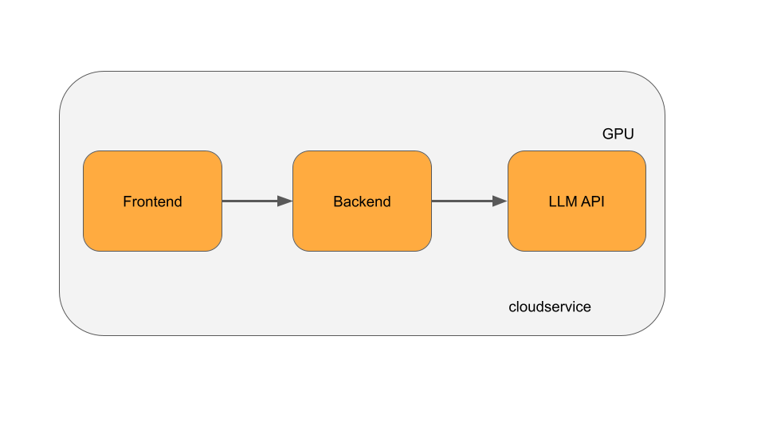

# Preferred Networks インターンシップ 2023 テーマ別課題

この課題ではインターンのテーマに沿った専門知識の理解度を問います。
あなたが選んだ第一希望テーマに相当する設問を以下の中から選び、その解答を提出して下さい。

設問が記述形式のものである場合は、`survey.pdf` というファイル名で A4 サイズの PDF にまとめて下さい。
ページ制限、様式については各設問で指定された形式に従って下さい。
特に指定がない場合はページ数は2枚以内（参考文献の節を含む）、様式は自由であるとします。

設問が記述形式以外である場合は、各設問で指定された形式で提出してください。
`zip` 形式での提出が指定された場合は、`survey.zip` というファイル名で提出してください。

### 諸注意
本課題が添付されていたメール本文に記載のご案内をよくご確認ください。

課題には自分だけで取り組んでください。この課題を他の応募者を含めた他人と共有・相談することを禁止します。
**GitHub の公開リポジトリや SNS 等に解答や問題をアップロードする行為も禁止します。** (選考期間終了後、インターンシップ運営が問題を公開する可能性があります。インターンシップ運営が問題を公開した後は、公開されたテーマ課題に限って解答を公開したりしていただいても構いません。)
漏洩の証拠が見つかった場合、その応募者は失格となります。ある応募者が別の応募者に回答をコピーさせた場合、双方の応募者が失格となります。

想定所要時間はコーディング課題とテーマ別課題の両方を合わせて最大2日です。全課題が解けていなくても提出は可能ですので、学業に支障の無い範囲で取り組んで下さい。

インターンとして採用された場合、インターン業務により生じた知的財産はPFNに帰属します。
**テーマ選択にあたっては、ご自身の所属機関における研究テーマ等を持ち込まないようご留意ください。**

テーマ別課題では、テーマに沿った知識・技術の理解度を評価します。
回答の際には、発明の帰属に関する紛争を避けるため、未発表の研究成果や独自の問題解決アイディアのような **特許性のある新しいアイディアは提出物（レポート等）に含めないでください。**

### 提出方法
提出物をこちらの専用フォーム (https://forms.gle/x5z6GdhTvu3WE6jY8) へ提出してください。締切は **2023年5月7日（日）23:59 (日本時間) 必着** です。時間に余裕をもってご提出ください。

### 問い合わせ
問題文に関して質問がある場合は intern2023-admin@preferred.jp までご連絡ください。問題文に訂正が行われた場合は応募者全員にアナウンスいたします。なお、アプローチや解法に関する問い合わせにはお答えできません。


<div style="page-break-before:always"></div>

## 1. 大規模言語モデルの学習手法等の技術開発

次の候補論文の中から一つ選択して、仮想的な査読レポートを作成してください。

候補論文
* Dao, T., Fu, D.Y., Ermon, S., Rudra, A., & R'e, C. (2022). FlashAttention: Fast and Memory-Efficient Exact Attention with IO-Awareness. ArXiv, abs/2205.14135.
  + https://arxiv.org/abs/2205.14135 
* Narayanan, D., Shoeybi, M., Casper, J., LeGresley, P., Patwary, M., Korthikanti, V.A., Vainbrand, D., Kashinkunti, P., Bernauer, J., Catanzaro, B., Phanishayee, A., & Zaharia, M.A. (2021). Efficient Large-Scale Language Model Training on GPU Clusters Using Megatron-LM. SC21: International Conference for High Performance Computing, Networking, Storage and Analysis, 1-14.
  + https://dl.acm.org/doi/10.1145/3458817.3476209 
* Sheng, Y., Zheng, L., Yuan, B., Li, Z., Ryabinin, M., Fu, D.Y., Xie, Z., Chen, B., Barrett, C.W., Gonzalez, J., Liang, P., Ré, C., Stoica, I.C., & Zhang, C. (2023). High-throughput Generative Inference of Large Language Models with a Single GPU. ArXiv, abs/2303.06865.
  + https://arxiv.org/abs/2303.06865 

レポートは以下の内容を含んでください。

* 論文のタイトル
* 論文の内容のサマリー
* この論文/研究のストロングポイント、最低１点、最大３点
* この論文/研究のウィークポイント、最低１点、最大３点

回答には、新規性を別途主張できるような、定式化やモデルの改善案などは含めないでください。

### レポートの分量について
A4 PDFで２ページ以内で回答してください。

<div style="page-break-before:always"></div>

## 2. Kubernetes 上の機械学習ワークロードのネットワーク帯域モニタリング

### 問題1
Kubernetes クラスタで Deployment リソースを作成してから Kubernetes ノード上でコンテナが実行されるまでの処理の流れ、また登場する Kubernetes システムコンポーネントの役割の2点を図も用いてレポートとしてA4サイズ2枚以下でまとめてください。

### 問題2
[PFNのKubernetesクラスタのCNI Plugin](https://tech.preferred.jp/ja/blog/cni-plugin-in-pfn-kubernetes-cluster/) のブログの [Kubernetesクラスタのネットワーク構成（第1世代）](https://tech.preferred.jp/ja/blog/cni-plugin-in-pfn-kubernetes-cluster/#first-gen-kubernetes-networking) の節では、内製のCNI Pluginを使った場合にCluster IPが使えなくなる課題があり、kube-proxyにパッチを当てることで解決したことが述べられています（下記の引用部分）。この解決策とはアプローチが異なる解決策、または同じアプローチでも実装方法が異なる解決策を検討しレポートに書いて提出してください。 **ただし、新規性を別途主張できるような（特許性のある）解決策は含めないようにしてください。** レポートはA4サイズ2枚以下でまとめて下さい。

- 必要に応じて図や表、擬似コードなど文章以外の表現を用いても構いません。
- 複数の方法が考えられる場合、それぞれの方法について説明してください。ただし、全ての考えられる方法を列挙する必要はありません。比較検討を行う価値が低いと考える方法については書く必要はありません。
- 複数の方法について説明する場合、各方法の利点と欠点を含めた特徴を比較し、自分が最もよいと考える方法を、よいと考える理由と共に説明してください。理由を説明するために、ブログや本設問からは読み取れないことを仮定しても構いません。このとき、どのような仮定をおいたのかを明記してください。

> このCluster IPの問題を解決する一つのアプローチとして、kube-proxyがホストのnetwork namespaceに設定するiptablesのルールと同一のルールをpodのnetwork namespaceに対しても設定するという方法があります。第1世代の構成ではこのアプローチをとってCluster IPの問題の解決に当たりました。実際の実装方法としては、kube-proxyにパッチを当てる方法をとりました。ホストのnetwork namespaceだけでなく、ノードに存在する全podのnetwork namespace（正確にはホストネットワークを使わないpodのnetwork namespaceに限定）に対してもiptablesのルールを設定するようなパッチを作成しkube-proxyに適用しました。

### 提出
問題1、問題2で作成したレポートをzipでまとめた圧縮ファイルを提出してください。

<div style="page-break-before:always"></div>

## 3. キャッシュを利用した機械学習・深層学習ワークロードの加速

### 問題1
Kubernetes クラスタで Deployment リソースを作成してから Kubernetes ノード上でコンテナが実行されるまでの処理の流れ、また登場する Kubernetes システムコンポーネントの役割の2点を図も用いてレポートとしてA4サイズ2枚以下でまとめてください。

### 問題2
以下に示す仕様のHTTP APIサーバをGo言語を用いて実装して、Kubernetesクラスタにデプロイするマニフェストファイルを作成し、デプロイしてください。
標準ライブラリやサードパーティのライブラリを利用しても構いません。

#### HTTP APIサーバの仕様
- ポート 8080番でリッスン
- POST /access
  - 以下のJSON形式を返してください。
    - Pod 自身の IPアドレス "backend_ip"
    - 接続元の情報 "src"
      - 接続元のIPアドレス "ip"
      - その接続元から これまでにPOST された回数 "accesses"
        - アクセスカウンタは、APIサーバ内のメモリ上に保持し、サーバが再起動されたときに回数がリセットされるようにしてください。
  - JSONの具体例
    - 192.168.1.2から192.168.1.1に10回HTTPリクエスト(POST)を送信した場合
      - `{"backend_ip":"192.168.1.1", "src":{"ip":"192.168.1.2","accesses":10}}`
    - 192.168.1.3から192.168.1.1に1回HTTPリクエスト(POST)を送信した場合
      - `{"backend_ip":"192.168.1.1", "src":{"ip":"192.168.1.3","accesses":1}}`
- それ以外の場合は適切な HTTP エラーを返してください。

#### デプロイについて
Deploymentをはじめ、あなたがサーバのデプロイに必要だと考えるマニフェスト一式を作成してください。Deployment の Pod レプリカ数は 3としてください。

Kubernetes クラスタはローカルに構築し、HTTP API サーバの動作確認を行ってください。ローカルにクラスタを作成するツールには [kind](https://kind.sigs.k8s.io/) や [Minikube](https://minikube.sigs.k8s.io/docs/) があります。それ以外を利用しても構いません。

#### 提出について
下記ファイル群をフォルダにまとめて、他の課題と一緒に添付ファイルとして提出してください。
- Kubernetes マニフェストファイル
- HTTP サーバのGoソースコード
- Dockerfile
- README
  - HTTP APIサーバの起動の仕方
  - プログラムの説明・工夫したところ（あれば）

### 問題3
以下の3項目を実験し、その様子を作業ログを含めたレポートにまとめてください。

#### 項目1
前問で利用したKubernetesクラスタ内にHTTP APIサーバの動作確認を行うためのPodを作成してください。

#### 項目2
そのPodの中からHTTPリクエストを発行するたびに、3つのPodのうちどれかのPodにルーティングされること（つまり、観測される"backend_ip"が一定ではなく、3つのPod IPからランダムに選ばれていること）を確認してください。

#### 項目3
POSTされた回数 "accesses" が、あるPodからHTTPリクエストを発行するたびにどのように出力されるかを確認してください。
5回発行すると以下のようになっていることが期待されます。

```
$ for i in `seq 1 5`; do curl -X POST http://$cluster_ip/access; done
{"backend_ip":"192.168.1.2", "src":{"ip":"192.168.0.1","accesses":1}}
{"backend_ip":"192.168.1.3", "src":{"ip":"192.168.0.1","accesses":1}}
{"backend_ip":"192.168.1.1", "src":{"ip":"192.168.0.1","accesses":1}}
{"backend_ip":"192.168.1.2", "src":{"ip":"192.168.0.1","accesses":2}}
{"backend_ip":"192.168.1.1", "src":{"ip":"192.168.0.1","accesses":2}}
```

ここで、アプリケーションやマニフェストを変更して、5回発行したときに "accesses" が 5 になるように変更したいです。どのような変更を行えばよいか、検討してまとめてください。

```
$ for i in `seq 1 5`; do curl -X POST http://$cluster_ip/access; done
(省略)
{"backend_ip":"192.168.1.1", "src":{"ip":"192.168.0.1","accesses":5}}
```

### 提出方法

下記の3点を1つのzipファイルにして提出してください。
- 問題1のレポート
- 問題2の成果物のフォルダ一式
- 問題3のレポート

<div style="page-break-before:always"></div>

## 4. 機械学習向け Kubernetes クラスタまたは周辺サービス・ツールの開発・調査・検証

### 問題1

Kubernetes クラスタで Deployment リソースを作成してから Kubernetes ノード上でコンテナが実行されるまでの処理の流れ、また登場する Kubernetes システムコンポーネントの役割の2点を図も用いてレポートとしてA4サイズ2枚以下でまとめてください。

### 問題2

[KubeCon + CloudNativeCon North America 2022 のセッションリスト](https://www.youtube.com/playlist?list=PLj6h78yzYM2O5aNpRM71NQyx3WUe1xpTn)からあなたが関心を持つ1つを選択し、「セッション内容の解説」と「あなたがそのセッションを選択した理由、面白いと感じるポイント」をレポートとしてA4サイズ2枚以下でまとめてください。

### 提出
問題１、問題２で作成したレポートをzipでまとめた圧縮ファイルを提出してください。

<div style="page-break-before:always"></div>

## 5. 深層学習・分散シミュレーションに供するストレージ基盤の開発・性能改善

以下の設問に回答してください。適宜図を取り入れたり参考資料を引用したりして構いませんが、未発表の論文やアイデアなど、新規性が別途主張できる内容は含めないように注意してください。

**設問 1:** SSD と HDD について、記憶装置の物理的な構造の違いについて解説してください。また、それぞれが得意とする用途や I/O アクセスパターンについて、構造上の違いとの関係を含めて述べてください。

**設問 2:** ストレージシステムに 1 KiB のファイルを 1000 万個格納したいです。必要な空き容量は十分にあるとしたとき、どんな問題が懸念されますか。また、その問題はどのような解決法が考えられますか。ここでのストレージシステムとはローカルファイルシステムや並列ファイルシステム、分散ストレージなどの中から答えやすいものを仮定して構いません。

**設問 3:** S3 互換のストレージシステムがあります。このシステムを評価するベンチマークの設計について論じてください。システム評価の観点は多様なので、どのような指標で評価するかという観点から自由に決めてもらって構いません。また、設計したベンチマークを今後実装する場合、どのような工夫ができそうか考察してください。実装にあたっては既存の実装やライブラリも活用できるとします。必要に応じて S3 API のリファレンス [1] も参照してください。

[1] [Amazon S3 - Amazon Simple Storage Service](https://docs.aws.amazon.com/AmazonS3/latest/API/API_Operations_Amazon_Simple_Storage_Service.html)


### 提出方法

上記3設問に対する回答を、A4サイズのPDF２ページ以内にまとめて提出してください。

<div style="page-break-before:always"></div>

## 8. MN-Core 向けのコンパイラ及び周辺ライブラリの開発

以下2つのテーマの課題のうち、どちらか1つのみを選択し回答して下さい
- テーマ9: 深層学習モデルを社会実装するためのフレームワーク・ライブラリ開発
- テーマ10: CuPy の開発

<div style="page-break-before:always"></div>

## 9. 深層学習モデルを社会実装するためのフレームワーク・ライブラリ開発

演算ノードとそれらの入出力からなる計算グラフの問題について回答してください。

### 小問1.
ONNXのような深層学習の計算グラフをC++やRustのようにGCを搭載しない言語のような疑似コードで表現してください。計算グラフは静的単一代入(SSA)形式なグラフで、演算ノード(Node)、演算ノード間の接続(Value)、Nodeを実行順に保持する(Graph)のような名前を持ちそれらの各所有権の関係も小問2, 3に適した形で記述してください。参照型として、参照カウント型(std::shared_ptr/std::rc::Rcに相当)、単一所有権型(std::unique_ptr/std::boxed::Boxに相当)、弱参照型(std::weak_ptrまたはポインタ型/std::rc::Weakまたは参照型)を使用し、Nodeにはオペレーター名を文字列型で保持してください。

### 小問2.
小問1で定義したグラフで1入力1出力で演算を行わない”NOP”名を持つ演算ノードをグラフから削除する疑似コードを書いてください。変換後にメモリリークやダングリングポインタが発生しない形で記述してください。

### 小問3.
小問1で定義したグラフで1出力をもつ “opA”名を持つ演算ノードの出力に1入力1出力で演算を行わない “NOP” 演算ノードを追加する疑似コードを書いてください。変換後にメモリリークやダングリングポインタが発生しない形で記述してください。
### 小問4.
小問1で定義したグラフに各入力データと各Valueの消費バイト数が与えられる場合、与えられた実行順でグラフを実行する際のメモリ消費量を予測してください。メモリの確保や解放をどのように行うかは自由に決めてよいとします。
### 提出物
以下をzipファイルにまとめて提出してください。
- 解答をA4用紙2枚程度にまとめたレポート
- レポートの説明の補足や検証に用いたソースコード (任意)

<div style="page-break-before:always"></div>

## 10. CuPy の開発

以下の2問について解答してください。なお、解答における議論、実装内容などについては、新規性（未だ社会に公開されておらず、特許となりうるような内容）をもつ内容を含まない範囲にとどめる様に留意してください。

### 問1. Comparison between CPU and GPU algorithms
一次元上にn個の区間があり、それぞれの両端の座標が与えられています。n個の区間から二つの区間を選ぶ組み合わせは nC2 通り存在しますが、それらのうち二つの区間が重ならないような組み合わせの数を求めたいと考えています。この問題をGPUを搭載した実行環境で効率よく解くために、CUDA を用いて実装するのが望ましいでしょうか？

C++ を用いてCUDAを用いたプログラムとCUDAを用いないプログラムをそれぞれ実装してください。また、いくつかの入力の性質や条件を考えて、それぞれ仮定した場合について性能比較を自由に論じてください。必要であれば、CUDAに付属する標準ライブラリ（Thrust, CUBを含む）を使用しても構いませんが、それ以外のライブラリは使用しないでください。

### 問2. NumPy Quiz
以下の全ての小問について、それぞれの処理を行う Python プログラムを NumPy を用いて実装してください。ただし、以下で与えられる「配列」とは、全て NumPy の ndarray を意味するものとします。

1. 二つの一次元の配列 `a`, `b` を与えられたときに `c[i, j] = a[i] + b[j]` となるような二次元配列 `c` を求めてください。
2. nを1以上の整数とします。(2, n) の shape を持つ二次元配列 `x` が与えられるので、`x[1]` の昇順の順序で `x[0]` を並び替えた結果を求めてください。
3. 与えられた一次元配列に含まれる欠損値 (`np.nan`) の値を左右の最も近い nan でない値から線形補間によって埋める処理を `np.interp` を用いずに行ってください。ただし、始端と終端は nan ではないと仮定しても構いません。
4. 同じ shape を持つ二つの二次元配列 `a`, `b` が与えられるとき、以下の処理を for 文を使わない形式で書き換えてください。
```py
n = len(b)
res = np.zeros_like(a)
for i in range(n):
    res += (a == b[i]) * (i + 1)
```

### 提出物
以下の内容を一つのzipファイルにまとめて提出してください。
- 問1の実装コード
  * 性能比較に用いたプログラム
  * プログラムの実行環境情報
  * コンパイルを行うためのコマンドライン
  * 出力の値の正当性が確認できるテストコード
  * プログラムの可読性のために必要な最小限のコメント
- 問1のレポート
  * レポートはA4 2枚程度にまとめてください。
  * 工夫した点や、性能評価に対する考察を記載してください。
- 問2の実装コード
  * py形式、もしくはipynb形式の Python プログラム
  * プログラムの実行環境情報
  * 出力の値の正当性が確認できるテストコード
  * プログラムの可読性のために必要な最小限のコメント

<div style="page-break-before:always"></div>

## 11. Optuna および Optuna Dashboard の開発

### 基礎調査問題

二値分類の評価に用いられる ROC 曲線について、少なくとも以下の項目を含めて説明してください。

* 横軸と縦軸の意味
* プロットの方法と曲線の形状
* AUC の値の値域と解釈方法

説明にあたっては、必要に応じて図や表、数式などを用いて、詳細に説明してください。また、調査にあたって利用した文献は適切に引用してください。

### 応用記述問題（オプション課題：加点要素）

Optunaはdefine-by-runにより、提案された変数の値に依存した探索空間を記述することができるブラックボックス最適化ライブラリです。例えば、以下のコードスニペットが示すように、変数 `regressor_name` の値に依存して利用する回帰モデルが変わる、といった場合でもif文を用いて自然に記述することができます。一方で、ガウス過程に基づくベイズ最適化のように事前に探索空間をdefine-and-runに定義することで変数間の相関を捉えられるアルゴリズムも存在します。

```python
def objective(trial):
    regressor_name = trial.suggest_categorical('regressor_name', ['SVR', 'RandomForest'])
    if regressor_name == 'SVR':
        svr_c = trial.suggest_float('svr_c', 1e-10, 1e10, log=True)
        regressor_obj = sklearn.svm.SVR(C=svr_c)
    else:
        rf_max_depth = trial.suggest_int('rf_max_depth', 2, 32)
        regressor_obj = sklearn.ensemble.RandomForestRegressor(max_depth=rf_max_depth)
    ...
```

define-by-runとdefine-and-runを共存させるための仕組みという観点から、[こちらのドキュメント](https://optuna.readthedocs.io/en/stable/reference/samplers/generated/optuna.samplers.BaseSampler.html)やOptunaのソースコードを読んだ上でBaseSampler.sample_independentとBaseSampler.sample_relativeの必要性・役割について説明してください。

### レポート分量

回答はA4サイズのPDF２ページ以内にまとめて提出してください。

<div style="page-break-before:always"></div>

## 12. Matlantis と Optuna を利用した結晶構造探索

以下の二つの設問に答えてください。

(1) 多目的最適化問題の分析に用いるパレートフロントの可視化について、少なくとも以下の項目を含めて説明してください。
- プロットの目的と全体像
- パレート解・非パレート解との関係
- 近似方法とプロットの方法

説明にあたっては必要に応じて用語の定義を行い、図や表、数式などを用いて詳細に説明してください。また、調査にあたって利用した文献は適切に引用してください。説明の分量はA4で半ページ程度を目安にしてください。

(2) 結晶構造探索の分析に用いる状態図について、少なくとも以下の項目を含めて説明してください。
- プロットの目的と全体像
- 安定構造と準安定構造の分布
- 凸包の意味
- 近似方法とプロットの方法

説明にあたっては必要に応じて用語の定義を行い、図や表、数式などを用いて詳細に説明してください。また、調査にあたっては[ASEのチュートリアル](https://wiki.fysik.dtu.dk/ase/tutorials/ga/ga_convex_hull.html)を参考にしてください。説明の分量はA4で半ページ程度を目安にしてください。

### 応用調査問題

以下の最適化問題を解く手法を考えてください。手法の説明はA4で1ページ程度を目安にしてください。また、その手法を実装するプログラムを作成すればオプショナルで加点します。実装に用いる言語はPythonを使用してください。

#### 問題について
3次元空間上に2種類の点AとBを合わせて24個配置します。24個のうちAとBがそれぞれ幾つであるかは変わりうるとします。また点は重ならないとします。この配置xに対してスカラー値を返す関数を目的関数f(x)とします。この目的関数fの出力に対して、以下のように定義される曲線Cが"より良く"なるようにしてください。

横軸に全体の点数(=24)に対する点Aの個数の比、縦軸に目的関数値をとるような二次元の図(下図を参照)を考えます。あるAとBの配置をxとすると、点Aの全体の点数(=24)に対する個数の比はxの実数値関数r(x) (0以上1以下の実数)として定まります。あるAとBの配置xとその配置に対する目的関数の評価値f(x)のペア(x, f(x))は、この二次元の図におけるある一点(r(x),f(x))に対応します。最適化の中で探索した複数のペア{(x_i, f(x_i))}に対して定まる点の集合{(r(x_i), f(x_i))}を考え、この点集合の凸包の下側曲線をCとします。一方で、AとBのあらゆる配置とその配置に対する目的関数のペア{(x, f(x))}に対して定まる点の集合{(r(x), f(x))}について、この点集合の凸包の下側曲線をC^*とします。Cは最適化アルゴリズムによって得られるものですが、C^*は未知のものです。Cが"より良い"とはC^*に近いこととします。ただしC^*は未知のものなので、Cの最適性、すなわちC^*に等しいことを証明する手段はありません。我々は、Cがより下側にくるようにアルゴリズムを設計することになります。

この課題は、結晶構造を探索する問題を模しています。点A,Bを原子、スカラー値をエネルギーとみなすことで、エネルギーが低く安定となるような原子の配置=結晶の構造を様々な組成(=Aの個数の比)に対して考える問題とみなすことができます。なおこの課題では、時間をかけて性能の高い最適化アルゴリズムを作り込む必要はありません。その代わり、見通しの良いアルゴリズムとそのモチベーションの説明を心がけてください。

#### 目的関数について
目的関数はPythonの原子シミュレーションライブラリASEのv3.22.1(2023年4月11日現在の最新版)を用いて定義される以下のような関数Objective.__call__であるとします。この目的関数の定義は変えてはいけません。

```python
from __future__ import annotations

from collections import defaultdict
from ase import Atoms
from ase.calculators.emt import EMT
import numpy as np
import plotly.graph_objects as go
import random
from scipy.spatial import ConvexHull


N_ATOMS = 24
INF = 1e+10


class Objective:
    def __init__(self) -> None:
        pass

    def __call__(self, x: tuple[list[str], list[list[float]]]) -> float:
        atom_type = x[0]
        positions = x[1]

        atoms = Atoms(
            numbers=[self._char2number(c) for c in atom_type],
            positions=positions,
        )
        atoms.calc = EMT()
        e = atoms.get_potential_energy()
        return e

    @staticmethod
    def _char2number(c: str) -> int:
        return 29 if c == 'A' else 78
```

#### 曲線について
最適化の中で探索した配置と目的関数の評価値のペアに対して、曲線Cを出力するプログラムを以下に示します。このプログラムは分析結果がわかりやすくなるように適宜変更して構いません。

```python
def plot_result(xs: list[tuple[list[str], list[list[float]]]], ys: list[float]) -> go.Figure:
    layout = go.Layout(
        xaxis={"title": "Ratio #A/24"},
        yaxis={"title": "Objective value", "range": [0, 1000]},
    )

    ratios = []
    for x in xs:
        ratios.append(x[0].count('A') / N_ATOMS)

    ratio_to_miny = defaultdict(lambda: INF)
    for ratio, y in zip(ratios, ys):
        ratio_to_miny[ratio] = min(ratio_to_miny[ratio], y)
    points = []
    for ratio, miny in ratio_to_miny.items():
        points.append([ratio, miny])
    points = np.asarray(points)
    hull = ConvexHull(points)
    curveC = points[hull.vertices]
    curveC = curveC[np.argsort(curveC[:, 0])]

    traces = []
    traces.append(go.Scatter(x=ratios, y=ys, mode="markers", name="search points"))
    traces.append(go.Scatter(x=curveC[:, 0], y=curveC[:, 1], name="curve C"))

    return go.Figure(data=traces, layout=layout)

```

#### ベースライン
アルゴリズムのベースラインとして、ランダムに配置を1000個生成し目的関数に与え曲線Cを出力するプログラム、および出力されたplot.pngを以下に示します。

```python
xs = []
for _ in range(1000):
    atom_type = ['A' if random.random() >= 0.5 else 'B' for _ in range(24)]
    positions = [[random.uniform(0, 20) for _ in range(3)] for _ in range(24)]
    xs.append((atom_type, positions))

objective = Objective()
ys = [objective(x) for x in xs]

fig = plot_result(xs, ys)
fig.write_image("plot.png")

```


### 提出物
以下の提出物を、一つのzipファイルにまとめて提出してください。
- 基礎調査問題レポート
- 応用調査問題レポート
- 応用調査問題のプログラム実装（あれば）

<div style="page-break-before:always"></div>

## 13. Matlantis を用いた材料探索アルゴリズムの開発
### 基礎調査問題
[Matlantis](https://matlantis.com/ja/)の技術的な特徴をまとめ、その技術の利点と課題を三つ以上列挙してください。
回答はA4 2ページ以内の文書にまとめて、PDFとして提供してください。

### 応用記述問題
`theme13/JE13_task.ipynb` を参照してください。

### 提出物
基礎調査問題、応用記述問題の成果物を、一つのzipファイルにまとめて提出してください。

<div style="page-break-before:always"></div>

## 14. 汎用原子レベルシミュレータ Matlantis における Web システムの開発、運用

あなたは自分で作成したLLMを用いたチャット形式の論文検索サービスをSaaSとして提供しようとしています。以下の図のようにシステムを設計することにしました。


### 前提条件・要件
あなたが作成したLLMには次のような特徴があります。LLMを動かすには1つのGPUが必要です。GPUには高級なものと低級なもの2種類があるとします。高級なGPUを用いてLLMを動かした場合、結果の生成の待ち時間が短くなります。低級なGPUを用いた場合は基本的に生成に長い時間がかかります。またこのLLMモデルでは複数のインプットを合わせてバッチで推論できます。またあなたは一ヶ月に一回以上モデルをアップデートするとします。
あなたはこのシステムをデプロイするのにクラウドサービスAを利用する予定です。このクラウドサービスAは高級なGPUと低級なGPUを持つインスタンスがそれぞれ提供されていて、高級なGPUをもつインスタンスは値段が高く必ずしも在庫があるわけではないが、低級なGPUは値段が安く必ず在庫があるという特徴があります。
またこのサービスへのアクセスパターンには次のような特徴が現れるとします。あなたが作成したLLMは非常に優秀なため、時々twitterでバズります。そのため予期しないタイミングでリクエストの数が突然多くなることがあります。ただしサービスは日本でしか流行っていないため、日本時間深夜のリクエストは常に少ないです。

### 課題内容
あなたがこのSaaSの開発に参加する場合に、フロントエンド、バックエンド、インフラのいずれかもしくは複数の分野で、あなたが実装において重要だと思うポイントについてレポートをまとめてください。全ての分野を書く必要はありません。あなたが得意な分野についてまとめてください。
* より多くのポイントについて記述があった場合、加点します。
* **実装に必要な具体的なライブラリやサービスが明示されている場合、加点します。**
    * AWSやGCPなどのクラウドサービスをあげていただいても構いません。
* 例として以下のようなポイントがあると思われます。
    * フロントエンド, UX
        * 複数のモデルバージョンをどのように提供するか
        * 応答生成にかかる（体感）時間をどのように短縮するか
        * リアルタイムのチャットデータをどのように受信するか
    * バックエンド
        * リアルタイムのチャットデータをどのように配信するか
        * ホスティング方法
        * API プロトコルはどうするか
        * 複数のGPUタイプをどのように混ぜて使うか
    * インフラ
        * モデルのアップデート時にどのように障害を発生させないか
        * スケーリングのやり方
        * インフラコストの節約
    * その他
        * セキュリティ
        * 課金モデル
 
上記以外のポイントを書いていただいても問題ありません。
要件を全て満たさなくても構いません。

### レポートの分量
レポートはA4PDFで２枚以内としてください。

<div style="page-break-before:always"></div>

## 15. 材料に関する機械学習や原子シミュレーションの開発・応用研究

以下の回答をまとめたA4サイズ相当の1-2ページのPDFを提出してください。

### 基礎調査問題
原子シミュレーションと機械学習の双方に関わるトピックの論文を1本挙げて、論文のまとめを作成してください。評価の際、論拠となる先行研究などは全て適切に引用してください。読者は分野に対する基本的な知識を持っていると仮定して構いません。
まとめには以下の内容を含めてください。
- 論文のタイトル
- 論文の内容のサマリー
- 論文内で引用している先行研究を具体的に列挙し、それに対する論文の優位性。最低１点、最大３点
- 論文でその優位性を出せた理由

論文の選択は、もしあなたが本インターンで取り組もうと思っている課題がある場合には関連した論文を挙げてください。まだトピックが固まってない場合、以下から論文を選ぶことも可能です。

なお、もし本課題よりも ”Matlantis を用いた材料探索アルゴリズムの開発” の課題のほうが取り組みやすいと感じた場合は、そちらの課題への解答で代替することも認めます。

#### 論文リスト
- D. Pfau, J. S. Spencer, A. G. D. G. Matthews, and W. M. C. Foulkes, Ab Initio Solution of the Many-Electron Schr"odinger Equation with Deep Neural Networks, Phys. Rev. Research 2, 033429 (2020). https://journals.aps.org/prresearch/abstract/10.1103/PhysRevResearch.2.033429
- H. Li, Z. Wang, N. Zou, M. Ye, R. Xu, X. Gong, W. Duan, and Y. Xu, Deep-Learning Density Functional Theory Hamiltonian for Efficient Ab Initio Electronic-Structure Calculation, Nature Computational Science 2, 367 (2022). https://www.nature.com/articles/s43588-022-00265-6 (https://arxiv.org/abs/2104.03786)
- K. Shimizu, Y. Dou, E. F. Arguelles, T. Moriya, E. Minamitani, and S. Watanabe, Using Neural Network Potentials to Study Defect Formation and Phonon Properties of Nitrogen Vacancies with Multiple Charge States in GaN, Phys. Rev. B Condens. Matter 106, (2022). https://journals.aps.org/prb/abstract/10.1103/PhysRevB.106.054108 (https://arxiv.org/abs/2203.16789)
- M. Cools-Ceuppens, J. Dambre, and T. Verstraelen, Modeling Electronic Response Properties with an Explicit-Electron Machine Learning Potential, J. Chem. Theory Comput. 18, 1672 (2022).
https://pubs.acs.org/doi/abs/10.1021/acs.jctc.1c00978
- S. Batzner, A. Musaelian, L. Sun, M. Geiger, J. P. Mailoa, M. Kornbluth, N. Molinari, T. E. Smidt & B. Kozinsky, E(3)-equivariant graph neural networks for data-efficient and accurate interatomic potentials, Nat Commun 13, 2453 (2022). https://www.nature.com/articles/s41467-022-29939-5
- M. Xu, L. Yu, Y. Song, C. Shi, S. Ermon, J. Tang, GeoDiff: A Geometric Diffusion Model for Molecular Conformation Generation, The International Conference on Learning Representations (ICLR) 2022. https://openreview.net/forum?id=PzcvxEMzvQC
- C. Chen, S. P. Ong, A universal graph deep learning interatomic potential for the periodic table, Nat Comput Sci 2, 718–728 (2022). https://www.nature.com/articles/s43588-022-00349-3 (https://arxiv.org/abs/2202.02450)
- J. Kirkpatrick, et al. Pushing the frontiers of density functionals by solving the fractional electron problem. Science 374.6573 (2021). https://www.science.org/doi/10.1126/science.abj6511

### 応用記述問題 1
上述の優位性が本当に論文で主張されているものなのかを自分の手で確認するために、論文の手法と先行研究の手法を実際に比較して追加検証する作業を考えます。このときに、どのような実験や検証を行えば優位性が確かなものであると確認できるでしょうか。上でまとめた優位性の中から1点を選び、行うべき検証作業の流れを書いてみてください。

### 応用記述問題 2 [optional]
検証作業を進めていく具体的な作業内容について考えます。その時に気を付けるべきこと、実装にあたって論文中では曖昧になっている部分、技術的に難しそう・工夫が必要そうな部分としてどのようなことが想像されますか？思いつく観点をいくつか挙げてください。あくまでも論文の忠実な実装のための議論であって、近似計算の提案など、新規性が別途主張できるような工夫は考えないでください。

<div style="page-break-before:always"></div>

## 18. 遺伝子に関するグラフを利用したモデル学習

### 基礎調査問題（必須課題）

二値分類の評価に用いられる ROC 曲線について、少なくとも以下の項目を含めて説明してください。

- 横軸と縦軸の意味
- プロットの方法と曲線の形状
- AUC の値の値域と解釈方法

説明にあたっては、必要に応じて図や表、数式などを用いて、詳細に説明してください。また、調査にあたって利用した文献は適切に引用してください。

### 応用記述問題（オプション課題）

N=1,000 人のカスタマーと、 M=100,000個の商品に関する購買データがあります。あなたは、このデータを使ってカスタマーの購買行動の予測モデルを作りたい、という要請を受けました。データの特徴は以下の通りです。

- オンラインブックストアの購買データである
- 主データDは N x Mの行列（テーブルデータ）
- 行列の(n, m)要素はカスタマーID nの人が、商品mを購入した数を表す: D(n,m) = d (dは非負整数） 
- カスタマー、商品それぞれの属性データx_n, y_mが存在する
  - カスタマー属性としては年齢・性別・住所（県まで）が登録されている。ただし、データが欠けている部分も存在する。
  - 商品属性としては著者、出版社が必ず登録されていて、レビューが一部の商品にのみ登録されている。

このデータを用いて、新たに顧客になってもらえる見込みユーザを探すことが今回の目的です。この目的のために、あなたは新規カスタマーに対するアイテム購買確率を予測するモデルを作ることになりました。

このような予測モデルの実現のために、検討・検証が必要と思われる要素を網羅的に議論してください。特に、以下の要素については必ず意見を述べてください。

- データの特性
  - スパーシティ
  - カスタマー・商品のグループ
- 性能評価方法
  - train/val/testへのsplit方法
  - 予測精度の評価方法
- 適切なモデル

ただし、上記で述べた条件のほかにも、顕在化していませんが考慮すべき条件があるはずです。それらについてはご自身で考えて仮定し、議論に含めてください。

### レポートの分量について

A4のPDF 2ページ以内でレポートを作成して提出してください。

<div style="page-break-before:always"></div>

## 19. 機械学習技術の健康診断・健康保険・診療データ解析への応用

### 基礎調査問題（必須課題）

二値分類の評価に用いられる ROC 曲線について、少なくとも以下の項目を含めて説明してください。

- 横軸と縦軸の意味
- プロットの方法と曲線の形状
- AUC の値の値域と解釈方法

説明にあたっては、必要に応じて図や表、数式などを用いて、詳細に説明してください。また、調査にあたって利用した文献は適切に引用してください。

### 応用記述問題（オプション課題）

N=1,000 人のカスタマーと、 M=100,000個の商品に関する購買データがあります。あなたは、このデータを使ってカスタマーの購買行動の予測モデルを作りたい、という要請を受けました。データの特徴は以下の通りです。

- オンラインブックストアの購買データである
- 主データDは N x Mの行列（テーブルデータ）
- 行列の(n, m)要素はカスタマーID nの人が、商品mを購入した数を表す: D(n,m) = d (dは非負整数） 
- カスタマー、商品それぞれの属性データx_n, y_mが存在する
  - カスタマー属性としては年齢・性別・住所（県まで）が登録されている。ただし、データが欠けている部分も存在する。
  - 商品属性としては著者、出版社が必ず登録されていて、レビューが一部の商品にのみ登録されている。

このデータを用いて、新たに顧客になってもらえる見込みユーザを探すことが今回の目的です。この目的のために、あなたは新規カスタマーに対するアイテム購買確率を予測するモデルを作ることになりました。

このような予測モデルの実現のために、検討・検証が必要と思われる要素を網羅的に議論してください。特に、以下の要素については必ず意見を述べてください。

- データの特性
  - スパーシティ
  - カスタマー・商品のグループ
- 性能評価方法
  - train/val/testへのsplit方法
  - 予測精度の評価方法
- 適切なモデル

ただし、上記で述べた条件のほかにも、顕在化していませんが考慮すべき条件があるはずです。それらについてはご自身で考えて仮定し、議論に含めてください。

### レポート分量

A4 PDF２ページ以内で回答をまとめて提出してください。

<div style="page-break-before:always"></div>

## 22. 医用画像を対象とした機械学習手法に関する研究

以下にリストアップした論文から一編を選択して、仮想的な査読レポートを作成してください。評価の際、論拠となる先行研究などは全て適切に引用してください。査読レポートには以下を含んでください。
- 論文のタイトル
- 論文の内容のサマリー
- この論文/研究のストロングポイント、最低１点、最大３点
- この論文/研究のウィークポイント、最低２点、最大３点

ただし査読レポートを書く際に OpenReview 等のレポートを参照しないでください。盗用が認められた場合には減点します。
回答には、新規性を別途主張できるような、定式化やモデルの改善案などは含めないでください。

Lists of papers
- “Medical Diffusion: Denoising Diffusion Probabilistic Models for 3D Medical Image Generation”, https://arxiv.org/abs/2211.03364
- “CLIP-Driven Universal Model for Organ Segmentation and Tumor Detection”, https://arxiv.org/abs/2301.00785
- “Learning to Exploit Temporal Structure for Biomedical Vision-Language Processing”, https://arxiv.org/abs/2301.04558 
- “Universal Few-shot Learning of Dense Prediction Tasks with Visual Token Matching”, https://arxiv.org/abs/2303.14969 
- “Segment Anything”, https://arxiv.org/abs/2304.02643 
- その他 MICCAI2022, NeurIPS2022, ICML2022, ICLR2022/2023, CVPR2022 の論文のうち医用画像に関連する、もしくは医用画像への応用が考えられる研究論文。

レポートはA4 PDFで２ページ以内にまとめてください。

<div style="page-break-before:always"></div>

## 23. コンピュータービジョンのためのウェブアプリケーション開発

本課題では与えられた物体を撮影した多数の画像群を閲覧するブラウザベースのビューワーを実装し、そのコード全体を圧縮したzipを提出してください。
条件の異なる課題1, 2, 3がありますが、いずれか一つの回答で構いません。もし複数実装した場合は、より後ろの課題のものを選んでください。

### 課題のためのファイル

* i23-fe-images.zip (377MBあります): (リンクは現在削除済みです)
* UIサンプルの動画: (リンクは現在削除済みです)

### 課題1
i23-fe-images.zip中の `090-*{0,2,4,6,8}0.png` は物体を中心にカメラが赤道面を移動し撮影した18枚の画像です。
初期状態では090-000.png **相当** を表示し、ポインティングデバイスの左右方向ドラッグ操作で、カメラが動いたかのように別の画像に切り替わって閲覧できるUIを実装してください。添付の動画も挙動の参考にしてください。

他に満たすべき仕様は以下になります。

* 表示画像サイズはブラウザ画面の短辺の85%とすること
    * 解像度は快適に閲覧できる適当なサイズに変更して構いません（そのため、上記で **相当** と記載しています）
* クライアントサイドはTypeScript+Reactで実装し、PCのChromeもしくはFirefoxで動作すること
    * スマートフォンでも動くのが望ましいです
* サーバーサイドはnpmインストール可能なdevサーバー、もしくはdocker環境で起動するものを実装すること
* 回線速度が遅い環境でも快適に閲覧できること（devtoolのNetwork throttlingを利用することで検証できます）
    * 閲覧に支障がないと考えられる範囲で、画像群の解像度、フォーマット、配信形式などを変更して構いません。サーバーで動的に処理しても、事前に一括変換しても構いません
        * 事前処理が必要な場合は、手順をREADMEに記載もしくはスクリプトを同梱してください
* 必要な手順（起動方法、アクセス方法、画像の変換方法）を記述したREADMEを含めること

これ以外の挙動や構成、デザインに特に指定はありません。例えば以下の挙動の指定はありません。

* データのダウンロードタイミングに指定はありません。回線環境が遅くてもUXが悪くならない挙動を選んでください。例えば、以下の方法が考えられます
    * 初回に全てダウンロードする
        * 遅い回線向けに、インディケータを表示する、ユーザインタラクションが発生するまでダウンロードは遅延させるなどの処理が必要かもしれません
    * 操作ごとに逐次ダウンロードする
        * 遅い回線向けに、先読みロードをする必要かもしれません
* 画像の表示方法に指定はありません。例えば、以下のような方法が考えられますがいずれでも構いません（記述していない方法でも構いません）
    * imgで読み込む
    * background-imageで読み込む
    * canvasに描画する

### 課題2

課題1をより滑らかに画像が遷移する画面にしてください。
課題1では20度単位18枚の画像でしたが、より滑らかにするためにi23-fe-images.zip中の `090-*.png` の5度単位72枚の画像を活用してください。
72枚の画像は72MBあるので、受信方法を適切に検討して実装してください。全て使わず間引いても構いません。

### 課題3

課題1のUIを経度方向だけではなく緯度方向にも動作するようにしてください。
画像はi23-fe-images.zip中の全ての画像を活用してください。
全ての画像は396MBあるので受信方法を適切に検討して実装してください。全て使わず間引いても構いません（ `090-*.png` の画像だけ4倍の枚数あることに注意してください）。

<div style="page-break-before:always"></div>

## 24. 3D モデルや自由視点映像の復元・編集・生成

(画像は現在削除済みです)

上記のリンクに掲載した画像集合は、あるスマートフォンのカメラで撮影したものです。この画像集合から [neural radiance field （NeRF）](https://arxiv.org/abs/2003.08934) による三次元再構成を行うことを考えます。以下の回答をまとめたA4サイズの1ページのPDFを作成し、提出してください。
なお、現在執筆中の論文の内容や特許性があるようなアイデアや発明は書かないようにしてください。

(1) リンク先の画像集合には、NeRFの再構成品質に悪影響を与える可能性のある画像が含まれています。それらの画像を見つけ、要因ごとにまとめて列挙してください。なお、特定の要因に該当する画像が3枚以上ある場合は、3枚目以降は「など」として省略して構いません。また、再撮影せずに、再構成手法や前処理の工夫によってこれらの画像を有効活用できる可能性がある場合、その工夫についても記述してください。

例:
- 要因1: 他の画像と全く重なりのない領域を撮影している
  - 該当画像: 0001.jpg, 0004.jpg など
  - 工夫: ...


(2) 三次元再構成を実施する際、通常は各画像について撮影時のカメラの内部パラメータと外部パラメータが必要です。リンク先の画像はすべて、同一のスマートフォンのカメラで、内部パラメータ（焦点距離、画像中心、レンズ歪み）の設定を固定した状態で撮影されたものだと仮定します。撮影時の内部パラメータを推定し、記述してください。さらに、どのように推定したかについても説明してください。


(3) 内部パラメータが不正確な場合、NeRFの再構成結果の品質が低下することが想定されます。不正確あるいは未知の内部パラメータを入力としたNeRFの品質を向上させる方法に関する論文を2つ以上見つけて引用してください。その中で最も公開時期が新しい論文の内容を簡潔に説明し、提案手法や実験の欠点や懸念点についても触れてください。

<div style="page-break-before:always"></div>

## 25. 3D モデルや自由視点映像の復元・編集・生成

テーマ番号24 「3D モデルや自由視点映像の復元・編集・生成」の課題を解いてください。

<div style="page-break-before:always"></div>

## 26. AI 生成系アプリケーションの設計と実装

画像生成、大規模言語モデル、音声生成など、生成系AIを利用しているサービス（弊社のサービスを除く）を一つ取り上げて、分析および改善案を示したレポートを作成していただきます。
ただし、新機能の追加や現行機能の刷新など、新規性・特許性を別途主張できるような内容はレポートに含めないでください。

### 課題① サービスを分析する

取り上げたサービスをいくつかの切り口から分析してください。

* アプリケーション (フロントエンド・バックエンド・セキュリティ)
* システム (システムデザイン・インフラ・GPUクラスター)
* UI/UX (ユーザビリティ・デザイン・アクセシビリティ)
* プロダクト分析 (ユースケース・ターゲットユーザー・収益モデル・コミュニティ戦略)

ポイント：
1. 以上に分析の切り口の例を列挙していますが、これらに縛られず自由な観点でまとめていただいても構いません。
2. 分析にあたり、サービスの公開情報やその他の非公式な情報を引用する際には、引用元を明記してください。
3. まんべんなくカバーするより、特に興味関心を持っている側面に焦点を当てて分析すると良いでしょう。

### 課題② サービスの改善案を考える

課題①の回答に基づき、そのサービスをより良くするための改良案を考えてください。

### 提出物

回答はA4用紙2枚以内の分量でレポート作成し、PDFファイルとして提出してください。様式は自由です。
ソースコード、システム図、UIデザイン、プロダクトデザイン図などを作成する場合は、PDFに含まれるようにお願いします。どうしても必要な場合は、PDFレポートとその他のファイルをまとめたzipファイルを提出してください。

<div style="page-break-before:always"></div>

## 27. ディープラーニングを使ったクリエイティブへの応用

### 課題① 
ディープラーニングを使ったクリエイティブへの応用に関連する論文を一編選択して、仮想的な査読レポートを作成してください。レポートには以下の内容を含めてください。

- 論文タイトル
- 論文内容のサマリー
- 論文/研究の強み（1～3点）
- 論文/研究の弱み（1～3点）

### 課題②
次に、この論文で提案されたアプローチを実際に実装することを考えます。その際に考慮すべき点や論文内で曖昧な部分、技術的な課題を挙げてください。
ただし、あくまでも論文の忠実な実装のための議論であって、新しい手法の提案や独創的なアプローチなど、  **新規性が別途主張できるような工夫については、 *レポートに記載しない*で**ください。


### 課題に関する説明

2022年以降に、以下の国際会議で発表された論文の選択を推奨します。

- CVPR / ICCV / ECCV
- SIGGRAPH / SIGGRAPH Asia

リスト外の論文やArxiv上の論文も選択可能です。その場合、選択理由と、論文を使ってどのようにクリエイティブに関する課題を解決したいか述べてください。

評価の際に、先行研究などの根拠を適切に引用してください。

課題①と課題②に対する回答をまとめて、全体でA4用紙2ページ以内で作成し、PDFファイルとして提出してください。様式は自由です。

<div style="page-break-before:always"></div>

## 29. 小売店舗業務改善プロダクト開発

以下の課題1, 2の少なくとも一方についてレポートを記述して下さい。

### 課題1 データサイエンス系課題

#### 問題1  
二値分類の評価に用いられる ROC 曲線について、少なくとも以下の項目を含めて説明してください。
説明にあたっては、必要に応じて図や表、数式などを用いて、詳細に説明してください。また、調査にあたって利用した文献は適切に引用してください。 
- 横軸と縦軸の意味
- プロットの方法と曲線の形状
- AUC の値の値域と解釈方法

#### 問題2 
N=1,000 人のカスタマーと、 M=100,000個の商品に関する購買データがあります。あなたは、このデータを使って各商品の需要予測モデルを作りたい、という要請を受けました。
データの特徴は以下の通りです。
- スーパーの購買データである
- 主データDは 以下のカラムを持つテーブルデータ
  - datetime: 日時
  - user_id: 購買者のID
  - item_id: 商品ID
  - purchase_id: 取引ID（一度に会計したもののみ同一）
  - purchase_count: 購入数
- 購入者、商品それぞれの属性データx_n, y_mが存在する
  - 購入者属性としては年齢・性別・住所が登録されている。ただし、データが欠けている部分も存在する。
  - 商品属性としては商品名・金額が必ず登録されていて、商品画像が一部の商品にのみ登録されている。 
   
このデータを用いて、需要予測を行い店舗運営に反映することが今回の目的です。この目的のために、あなたは各商品の毎日の需要を予測するモデルを作ることになりました。

このような予測モデルの実現のために、検討・検証が必要と思われる要素を網羅的に議論してください。特に、以下の要素については必ず意見を述べてください。
- データの特性
- 性能評価方法
  - train/val/testへのsplit方法
  - 予測精度の評価方法
- モデル化手法
ただし、上記で述べた条件のほかにも、顕在化していませんが考慮すべき条件があるはずです。それらについてはご自身で考えて仮定し、議論に含めてください。

### 課題2 プロダクト開発系課題 
- 背景：小売店における業務改善プロダクトXを開発することになったと仮定します。 
Xはお店で働く店員の方々（ユーザー）が営業時間中に利用し、携帯型の端末を通じて操作できるものだとします。
また、プロダクトXでは、以下の要件を最低限満たす必要があります。
- 要件  
  - ユーザーは忙しい日々の業務の中で、すばやいレスポンスを期待している
  - Xの操作状況は他人が利用する際にもすぐに反映される
  - 作業記録は蓄積され、あとで分析のために活用できる
  - 同じ端末を複数人が共有して使用できる 
    
あなたがプロダクトXを提供する場合に、工夫できるポイントについてレポートにまとめてください。ただし、工夫点に新規性（未だ社会に公開されておらず、特許となりうるような内容）を別途主張できるような内容を含めないでください。
- 上記の要件だけで、不十分な場合は、適宜要件や前提を仮定して記載してください。
- レポートを書く際の観点の例として以下のようなポイントがあると思われます。（全て書く必要はありません。また、ご自身で新たな観点を追加していただいても構いません）
これまでのあなたの開発してきた成果物の経験を踏まえた記載を期待します。具体的な成果物を参照できる形で引用していただくなどしていただいても構いません。
- 観点
  - フロントエンド, UI/UX
    - バージョンごとの提供の方法
    - 忙しい業務の中でも直感的で使いやすい
    - ユーザーをどのように待たせるか
  - バックエンド 
    - どのようにAPIを提供するか
  - DB
    - 作業履歴の管理
    - 同時に複数人が作業した際にもconsistencyを保つこと
  - インフラ
    - アップデート時にどのように障害を発生させないか
  - セキュリティ
    - インプットをどのように扱うか？

### レポートの分量

レポートはA4サイズのPDF２ページ以内に収めて提出してください。

<div style="page-break-before:always"></div>

## 30. 小売業向け売上シミュレーション・値下げ戦略最適化

### 問題1
二値分類の評価に用いられる ROC 曲線について、少なくとも以下の項目を含めて説明してください。

- 横軸と縦軸の意味
- プロットの方法と曲線の形状
- AUC の値の値域と解釈方法

説明にあたっては、必要に応じて図や表、数式などを用いて、詳細に説明してください。また、調査にあたって利用した文献は適切に引用してください。

### 問題2
N=1,000 人のカスタマーと、 M=100,000個の商品に関する購買データがあります。あなたは、このデータを使って各商品の需要予測モデルを作りたい、という要請を受けました。

データの特徴は以下の通りです。
- スーパーの購買データである
- 主データDは 以下のカラムを持つテーブルデータ
  - datetime: 日時
  - user_id: 購買者のID
  - item_id: 商品ID
  - purchase_id: 取引ID（一度に会計したもののみ同一）
  - purchase_count: 購入数
- 購入者、商品それぞれの属性データx_n, y_mが存在する
  - 購入者属性としては年齢・性別・住所が登録されている。ただし、データが欠けている部分も存在する。
  - 商品属性としては商品名・金額が必ず登録されていて、商品画像が一部の商品にのみ登録されている。

このデータを用いて、需要予測を行い店舗運営に反映することが今回の目的です。この目的のために、あなたは各商品の毎日の需要を予測するモデルを作ることになりました。

このような予測モデルの実現のために、検討・検証が必要と思われる要素を網羅的に議論してください。特に、以下の要素については必ず意見を述べてください。
- データの特性
- 性能評価方法
  - train/val/testへのsplit方法
  - 予測精度の評価方法
- モデル化手法

ただし、上記で述べた条件のほかにも、顕在化していませんが考慮すべき条件があるはずです。それらについてはご自身で考えて仮定し、議論に含めてください。

### レポートの分量

レポートはA4サイズのPDFで、２ページ以内にまとめてください。

<div style="page-break-before:always"></div>

## 31. リテール分野を対象としたコンピュータビジョンに関する研究開発

[Training a Classifier — PyTorch Tutorials 2.0.0+cu117 documentation](https://pytorch.org/tutorials/beginner/blitz/cifar10_tutorial.html) では、PyTorchにより画像の分類器を学習する方法が解説されています。

このチュートリアルを読んで次の設問に回答してください。

チュートリアル中の画像分類手法を改善する方法として、考えられる手法を３つ挙げてそれぞれ説明してください。
その際、チュートリアル中の手法について簡単に説明を行い、それと改善案との差分を示してください。
ただし、**改善手法は必ず公知の情報（教科書に乗っていたり、既に論文として公開済みであったりする情報）とし、独自手法は含めないようにしてください。**
説明に際しては適切に参考文献を付け加えてください。
改善の方向性として、例えば分類精度、計算量といった観点が考えられますが、それらに限らずどういった改善でも構いません。

なお、回答は全体でA4用紙3枚に収まる程度として、PDFで提出してください。

<div style="page-break-before:always"></div>

## 34. プラント運転自動化のコアアルゴリズム技術開発

### 基礎調査問題

二値分類の評価に用いられる ROC 曲線について、少なくとも以下の項目を含めて説明してください。

* 横軸と縦軸の意味
* プロットの方法と曲線の形状
* AUC の値の値域と解釈方法

説明にあたっては、必要に応じて図や表、数式などを用いて、詳細に説明してください。また、調査にあたって利用した文献は適切に引用してください。

### 応用記述問題

N=1,000 人のカスタマーと、 M=100,000個の商品に関する購買データがあります。あなたは、このデータを使ってカスタマーの購買行動の予測モデルを作りたい、という要請を受けました。

データの特徴は以下の通りです。
* オンラインブックストアの購買データである
* 主データDは N x Mの行列
* 行列の(n, m)要素はカスタマーID nの人が、商品mを購入した数を表す: D(n,m) = d (dは非負整数） 
* カスタマー、商品それぞれの属性データx_n, y_mが存在する
    * カスタマー属性としては年齢・性別・住所（県まで）が登録されている。ただし、データが欠けている部分も存在する。
    * 商品属性としては著者、出版社が必ず登録されていて、レビューが一部の商品にのみ登録されている。

このデータを用いて、新たに顧客になってもらえる見込みユーザを探すことが今回の目的です。この目的のために、あなたは新規カスタマーに対するアイテム購買確率を予測するモデルを作ることになりました。

このような予測モデルの実現のために、検討・検証が必要と思われる要素を網羅的に議論してください。特に、以下の要素については必ず意見を述べてください。

* データの特性
  * スパーシティ
  * カスタマー・商品のグループ
* 性能評価方法
  * train/val/testへのsplit方法
  * 予測精度の評価方法
* 適切なモデル

ただし、上記で述べた条件のほかにも、顕在化していませんが考慮すべき条件があるはずです。それらについてはご自身で考えて仮定し、議論に含めてください。

### レポートの分量

レポートは上記２課題の回答をA4サイズのPDFで２ページ以内にまとめて提出してください。

<div style="page-break-before:always"></div>

## 36. ３次元物体認識などの認識モジュール開発
`README-en.pdf` に書かれている `36. Autonomous driving system for trucks. Development of perception modules such as 3D object detection.` の課題を解いてください。

<div style="page-break-before:always"></div>

## 37. 走行ログデータを用いたシミュレーションシナリオ自動生成ツール開発
以下の設問に答えてください。解答で使用した文献は適切に引用してください。

**回答には、新規性を別途主張できるような、評価指標やフレームワークの改善案などは含めないでください。**

以下の設問全てに対しての回答をまとめて、A4用紙2枚以内のレポートをPDFで作成して提出ください。

### 設問 1.
自動運転評価シナリオフレームワークの一つに、PEGASUS の 6-layer Model (https://arxiv.org/pdf/2012.06319.pdf) というものがあります。6-layer model の概要と特長について述べ、実データによって作成されたシナリオでカバーしやすい特長、しづらい特長についてレイヤーごとに述べてください。

### 設問 2.
車載カメラデータ以外にも様々なシナリオ作成手法があります。他のシナリオ作成方法として考えられるものを 2 種類挙げ、車載カメラデータによる作成と比較したメリット・デメリットを述べてください。

### 設問 3.
様々なシナリオを管理するデータベースを作成し、プランニングの性能改善を確認したい場合を考えます。データベースを作成するにあたって、考えられる課題をまとめてください。観点は自由に設定できますが、以下の観点を含めるようにしてください。
- フレームワークのカバレッジ
- 挙動の評価指標について、特に実車挙動が実データと異なる挙動を取った場合の評価方法
- シナリオそのものの品質評価やカバー
- それの実現に使用されるSWツール

<div style="page-break-before:always"></div>

## 38. 制御モジュールのための機械学習を用いた車両モデルの開発


### 注意事項

Task 1-2は、コーディング課題です。再現可能なJupyterノートブックを提出してください。

- Python3.10で動作するようにしてください。
- 必要なライブラリは、ノートブックの冒頭に`!pip install`を記述して、インストールしてください。

### Task 1 運動方程式のモデルを作る

空中に鉄球を射出する装置を考えます。鉄球は重力を受けて落下し始めますが、空気抵抗等の影響で、放物線を描くとは限りません。

鉄球の軌跡を予測するモデルを作成してください。

- モデルのパラメータには、重力加速度や空気抵抗係数に相当する物理定数が含まれるものとします。
- モデルの入力は、以下の3変数です。
  - 初期位置を表すXY軸の2次元ベクトル
  - 初期速度を表すXY軸の2次元ベクトル
  - 予測する未来の長さ

予測する未来の周期は0.01秒固定で差し支えありません。

### Task 2 運動方程式のモデルの訓練

Task 1の機械学習モデルが、初期位置(0,5)と初速(10,10)を与えた時に、添付の `theme38/motion.csv` に格納されたXY座標系の軌跡データを再現するように、物理定数を最適化するアルゴリズムを実装してください。

CSVには3個のカラムがあります。左からそれぞれ、

- タイムスタンプ (秒)
- X座標 (メートル)
- Y座標 (メートル)

です。
また、最適化後のモデルを用いて、適当な初期位置と初速での軌跡を可視化してください。

### Task 3 車両シミュレータへの応用

Task 1とTask 2で作成した機械学習モデルを応用して、自動車の運動を再現するシミュレータを作ることを考えます。

このシミュレータを自動運転で活用する上で、特に、実際の車両の挙動を忠実に再現するうえで、どのような課題がありますか？

Task3の回答は、A4サイズのPDF２枚以内で提出してください。

### 提出方法
Task1, 2で作成したjupyter notebookおよびTask 3で作成したレポートをzipファイルにまとめて提出してください。

<div style="page-break-before:always"></div>

## 39. 点群地図などを用いた自己位置推定モジュール開発

LiDARを用いた点群地図生成、あるいは点群地図を用いた自己位置推定に関する論文を一編選択して、レポートを作成してください。
- 論文のタイトル
- 論文の内容のサマリー
- この論文のストロングポイント
- この論文のウィークポイント

回答には、新規性を別途主張できるような、定式化やモデルの改善案などは含めないでください。

レポートの分量はA4サイズのPDFで２枚以内としてください。

<div style="page-break-before:always"></div>

## 42. 高い時空間解像度をもつ３次元雨雲レーダデータを用いた、気象状況の推定・予測技術の研究開発

[ 必須問題 ] 以下にリストアップした論文から一編を選択して、仮想的な査読レポートを作成してください。評価の際、論拠となる先行研究などは全て適切に引用してください。レポートには以下の内容を含めてください。
- 論文のタイトル
- 論文の内容のサマリー
- この論文/研究のストロングポイント、最低１点、最大３点
- この論文/研究のウィークポイント、最低１点、最大３点

回答には、新規性を別途主張できるような、定式化やモデルの改善案などは含めないでください。

### Lists of papers

- "ClimaX: A foundation model for weather and climate" http://arxiv.org/abs/2301.10343
- "WF-UNet: Weather Fusion UNet for Precipitation Nowcasting"  https://arxiv.org/abs/2302.04102
- "FourCastNet: A Global Data-driven High-resolution Weather Model using Adaptive Fourier Neural Operators"　http://arxiv.org/abs/2202.11214
- "WeatherFusionNet: Predicting Precipitation from Satellite Data"	https://arxiv.org/abs/2211.16824
- "Earthformer: Exploring Space-Time Transformers for Earth System Forecasting" https://proceedings.neurips.cc/paper_files/paper/2022/hash/a2affd71d15e8fedffe18d0219f4837a-Abstract-Conference.html	
- "MetNet: A Neural Weather Model for Precipitation Forecasting" https://arxiv.org/abs/2005.08748
- "PredRNN: Recurrent Neural Networks for Predictive Learning using Spatiotemporal LSTMs" https://proceedings.neurips.cc/paper/2017/hash/e5f6ad6ce374177eef023bf5d0c018b6-Abstract.html
- "Disentangling Physical Dynamics from Unknown Factors for Unsupervised Video Prediction" https://openaccess.thecvf.com/content_CVPR_2020/papers/Le_Guen_Disentangling_Physical_Dynamics_From_Unknown_Factors_for_Unsupervised_Video_Prediction_CVPR_2020_paper.pdf		

### 分量

レポートの分量はA4 PDFで2枚以内としてください。

<div style="page-break-before:always"></div>

## 43. SAR 画像に対する高度なセグメンテーション手法の研究開発

IEEE IGARSS2021/2022の論文のうち、SARデータのセグメンテーションに関する論文を以下にリストアップしました。そのうち一編選択して、仮想的な査読レポートを作成してください。評価の際、論拠となる先行研究などは全て適切に引用してください。
- 論文のタイトル
- 論文の内容のサマリー
- この論文/研究のストロングポイント、最低１点、最大３点
- この論文/研究のウィークポイント、最低１点、最大３点

回答には、新規性を別途主張できるような、定式化やモデルの改善案などは含めないでください。


[Lists of papers] 
- **Semi-Supervised Semantic Segmentation of SAR Images Based on Cross Pseudo-Supervision**, Haibo Zhang; Hanyu Hong; Ying Zhu; Yaozong Zhang; Pengtian Wang; Lei Wang, IGARSS 2022
- **Land Cover Semantic Segmentation of High-Resolution Gaofen-3 SAR Image**, Xianzheng Shi; Feng Xu, 2021 IEEE International Geoscience and Remote Sensing Symposium IGARSS
- **A Novel Deep Transfer Learning Method for SAR and Optical Fusion Imagery Semantic Segmentation**, Yanjuan Liu;Yingying Kong, 2021 IEEE International Geoscience and Remote Sensing Symposium IGARSS
- **A Dual-Fusion Semantic Segmentation Framework with Gan for SAR Images**, Donghui Li; Jia Liu; Fang Liu;Wenhua Zhang;Andi Zhang;Wenfei Gao; Jiao Shi, IGARSS 2022
- **Semantic Segmentation of SAR Images Through Fully Convolutional Networks and Hierarchical Probabilistic Graphical Models**, Martina Pastorino; Gabriele Moser; Sebastiano B. Serpico; Josiane Zerubia, IGARSS 2022
- **Semantic Segmentation of Land Use / Land Cover (LU/LC) Types Using F-CNNS on Multi-Sensor (Radar-Ir-Optical) Image Data**, Usman Iqbal Ahmed; Arturo Velasco; Bernhard Rabus, 2021 IEEE International Geoscience and Remote Sensing Symposium IGARSS
- **Assessing Buildings Damage from Multi-Temporal Sar Images Fusion using Semantic Change Detection**, Lei Pang; Fengli Zhang; Lu Li; Qiqi Huang; Yanan Jiao; Yun Shao, IGARSS 2022
- **Extraction of Floating Raft Aquaculture Areas from Sentinel-1 SAR Images by a Dense Residual U-Net Model with Pre-Trained ResNet34 as the Encoder**, Long Gao; Hongbo Su; Chengyi Wang; Kai Liu; Shaohui Chen, IGARSS 2022
- **The SpaceNet 8 Challenge - From Foundation Mapping to Flood Detection**, Ronny Hänsch; Jacob Arndt; Matthew Gibb; Arnold Boedihardjo; Tyler Pedelose; Todd M. Bacastow, IGARSS 2022

[回答の分量] 回答（レポート）は、A4 PDFで２枚までとしてください。

<div style="page-break-before:always"></div>

## 44. 機械学習技術の社会実装

### 問1

二値分類の評価に用いられる ROC 曲線について、少なくとも以下の項目を含めて説明してください。

* 横軸と縦軸の意味
* プロットの方法と曲線の形状
* AUC の値の値域と解釈方法

説明にあたっては、必要に応じて図や表、数式などを用いて、詳細に説明してください。また、調査にあたって利用した文献は適切に引用してください。


### 問2

N=1,000 人のカスタマーと、 M=100,000個の商品に関する購買データがあります。あなたは、このデータを使ってカスタマーの購買行動の予測モデルを作りたい、という要請を受けました。

データの特徴は以下の通りです。
* オンラインブックストアの購買データである
* 主データDは N x Mの行列（テーブルデータ）
* 行列の(n, m)要素はカスタマーID nの人が、商品mを購入した数を表す: D(n,m) = d (dは非負整数） 
* カスタマー、商品それぞれの属性データx_n, y_mが存在する
  * カスタマー属性としては年齢・性別・住所（県まで）が登録されている。ただし、データが欠けている部分も存在する。
  * 商品属性としては著者、出版社が必ず登録されていて、レビューが一部の商品にのみ登録されている。

このデータを用いて、新たに顧客になってもらえる見込みユーザを探すことが今回の目的です。この目的のために、あなたは新規カスタマーに対するアイテム購買確率を予測するモデルを作ることになりました。

このような予測モデルの実現のために、検討・検証が必要と思われる要素を網羅的に議論してください。特に、以下の要素については必ず意見を述べてください。
* データの特性
  * スパーシティ
  * カスタマー・商品のグループ
* 性能評価方法
  * train/val/testへのsplit方法 
  * 予測精度の評価方法
* 適切なモデル

ただし、上記で述べた条件のほかにも、顕在化していませんが考慮すべき条件があるはずです。それらについてはご自身で考えて仮定し、議論に含めてください。

### レポートの分量
提出するレポートはA4 PDF, 2ページ以内で簡潔に要点を絞って記述してください。

<div style="page-break-before:always"></div>

## 45. 拡散モデルに構造的な帰納バイアスを導入する基礎研究

gDDIM(https://arxiv.org/abs/2206.05564)  を読んで、以下の内容を含むリポートをA4サイズのPDFで提出してください。なるべく2ページ以内で作成してください。

- なるべく簡潔な言葉で論文の主定理集を要約し、依存関係を提示してください。

- DDIMとDDPMの違いがなぜ生まれるのか、あなたがこの論文を読んで解釈した根本的な理由を、なるべく煩雑にならないように理論的に説明してください。 

- あなたがこの論文についての追加実験をするなら、どのような追加実験をするか、流れと共に簡潔に書いてください。

<div style="page-break-before:always"></div>

## 46. 対称性を用いた 3D 表現学習と画像タスクへの応用


回答は2つの課題を合わせてA4サイズ、２ページ（日本語で2800文字数）に収まる範囲で書いて、PDFで提出してください。

### 課題１
あなたはある国際会議の査読者です．下にあるリストの中から一つ論文を選択して，仮想的な査読レポートを作成してください．
言語は日本語，英語どちらでも構いません．なおレポートは以下の内容を含んでください．

- 論文のタイトル
- 論文の内容のサマリー
- この論文/研究のストロングポイント、最低１点、最大３点
- この論文/研究のウィークポイント、最低１点、最大３点

回答には、新規性を別途主張できるような、定式化やモデルの改善案などは含めないでください。

paper list:
- Liu, R., Wu, R., Van Hoorick, B., Tokmakov, P., Zakharov, S., & Vondrick, C. (2023). **Zero-1-to-3: Zero-shot One Image to 3D Object**. arXiv preprint arXiv:2303.11328.
- Miyato, T., Koyama, M., & Fukumizu, K. (2022). **Unsupervised Learning of Equivariant Structure from Sequences**. arXiv preprint arXiv:2210.05972.
- Biza, O., van Steenkiste, S., Sajjadi, M. S., Elsayed, G. F., Mahendran, A., & Kipf, T. (2023). **Invariant Slot Attention: Object Discovery with Slot-Centric Reference Frames**. arXiv preprint arXiv:2302.04973.

### 課題２
あなたが最近読んで面白かった論文を一つ紹介してください．その分野に詳しくない人向けにわかりやすく書いてください（目安として理工系学部４年生に説明するイメージ）．論文はインターネット上で無料公開されているものであればどのようなものでも構いません．レポートは以下の内容を含んでください。

- 論文のタイトルとURL
- 論文の内容のサマリー
- 論文を知ったきっかけ
- 論文を読むのにかかった時間
- 面白いと思ったポイント，およびなぜ面白いと思ったのかの説明
- 理解が難しかった箇所（もしあれば）

<div style="page-break-before:always"></div>

## 47. 3D/4D 空間の再構成のためのユーザインターフェースの開発

回答には、新規性を別途主張できるような、定式化やモデルの改善案などは含めないでください。

### 課題1
これまでご自身が取り組んできた下記分野例に該当する研究・開発プロジェクトの概要を説明してください (600-1200字程度、図1,2点)

分野例: Human-Computer Interaction, Computer Graphics, Visualization, Machine Learning, Computer Vision, Accessibility, Information Retrieval

### 課題2
以下の1. 2.からひとつを選択して回答してください (1000-2000字程度)。必要に応じて適切な引用や図を使ってださい。
課題2では、ChatGPTなど大規模言語モデルを活用して回答することも可能です。
利用をした場合は、どのような活用を行ったか、プロンプトをどのように工夫したかについても短くまとめてください。

1. 以下の会議で出版された論文の中からHCI的アプローチを活用した3次元/4次元再構成に関する論文を1本選択し以下のQ1-Q5に回答をしてください<br>
会議: CHI2020-2023, UIST2020-2022, IUI2020-2023, SIGGRAPH2020-2022, SIGGRAPH Asia2020-2022, IEEE VR2020-2023, ISMAR2020-2023

Q1 どのような背景でこの研究が扱う課題にHCIのアプローチが必要となったか<br>
Q2 この研究が解決した問題は何か<br>
Q3 課題の解決方法とその特色は何か<br>
Q4 この論文の方法がうまくいくケースとうまくいかないケースは何か<br>
Q5 この論文の不十分な点とその理由は何か<br>

2. 以下のQ1-2について回答してください。

Q1 HCIはどのように3次元/4次元再構成に貢献できると考えますか。少なくとも3つの例を挙げてください。<br>
Q2 3次元/4次元再構成の問題設定を一つ決め、その難しさと効率化のための方法をいくつか説明してください。<br>

### 提出
A4サイズのPDFに、課題1, 2の回答を記載して提出してください（課題ごとにファイルを分割しないでください）。

<div style="page-break-before:always"></div>

## 48. デスクトップ VR

### 背景
デスクで行う様々な対話型タスクの有望なプラットフォームとして、デスクトップ・バーチャル・リアリティ（デスクトップVR）が近年登場し始めました。中でも現在最も注目を集めているのがおそらくバーチャルオフィスです。バーチャルオフィスを提供する製品として、Infinite Office、Horizon Workrooms、Virtual Desktop、vSpatial、Immersedなどが市場にリリースされていますが、これらの多くはマルチ仮想ディスプレイ、バーチャル会議室、コラボレーションスペースといったバーチャル要素によって物理オフィスや個人のワークスペースを再現しようとするものであり、VRの没入感や3D機能を最大限に活用できているものはほとんどありません。VRにおける仮想ディスプレイは、ユーザーのPC画面や非VRのデスクトップアプリケーションをそのまま平面に映し出したものにすぎず、キーボード、マウス、スマートフォン、デジタルペンなどの入力デバイスも現実世界と全く同じように使用されており、VRならではの新たな使い方が開拓されていません。

### 目標
本インターンシップでは、従来の物理的なデスクトップの設定や動作の再現にとどまらず、斬新なインタラクション技法、体験、シナリオを探究し、3D没入型のVRがもたらす豊かな可能性を実現する事を目標としています。「デスクトップVRに特化したデザインはどうあるべきか」が、探究を進める上で最初に問うべき問いの一つかもしれません。インターンシップは期間が短いため、広い領域の一面のみに特化する事にはなりますが、PFNインターンプロジェクトの成果は論文にまとめ、CHI、UIST、IEEE VRといったHCI/VRのトップカンファレンスで発表する事を目指します。

### 課題１
上記の背景と目標を踏まえ、デスクトップVRにおいてイノベーションを創出するためには、どの様な研究の方向性（バーチャルオフィスや「業務」のシナリオに限定せず）が望ましいか概要を記述してください。ここでは本インターンシッププロジェクトの具体的なアイデアではなく、斬新なインタラクション技法やシステムという観点から、探究すべきと考える概括的な道筋を記述してください。その研究の方向性に新規性があり、探究する価値があると考える理由も添えてください。また、あなたの主張を支援する材料として、関連するHCI/VR先行研究の論文を必ず参照するようにしてください。(本課題の主な目的は、新規性のある興味深い研究テーマを見出す能力を評価する事にあります。実際のインターンシッププロジェクトでは、ここに記載する内容とは異なる研究にフォーカスする場合がある旨、ご了承ください。)
また、あなたが提案する技法やシステムのPoC (実証実験用) プロトタイプを実装する場合、必要となる研究開発の技術・知識に関連するご自身の保有スキル・経験を明記してください。

### 課題２
普段開発に使用しているヘッドセットの性能や不随するVR SDKの機能について、（ユーザー視点ではなく）VR開発者として優れていると感心した点や制約など不満に感じた点を技術的な視点も含め記述してください。可能であれば、過去取り組んだプロジェクトでの具体的な経験を交えて記載してください。

### 課題３
マウス、デジタルペンとスマートフォンの3つのデバイスを使用した実証実験用のデスクトップVRアプリケーションを開発する場合、ユーザーへの影響（デバイスのユーザビリティ）を最小限に抑えながら、デスクの上の3D空間でこれらのデバイスをどの様にトラッキングするのが望ましいかを記述してください。既存のトラッキング技法やシステムを利用して実現する方法を考えてください。既存の技法やシステムでは限界があると思われる場合、その限界も説明してください。

### 回答方法
３つの課題への回答を１つのレポートにまとめてください。レポートはA4　PDFで２ページ以内でまとめてください。
