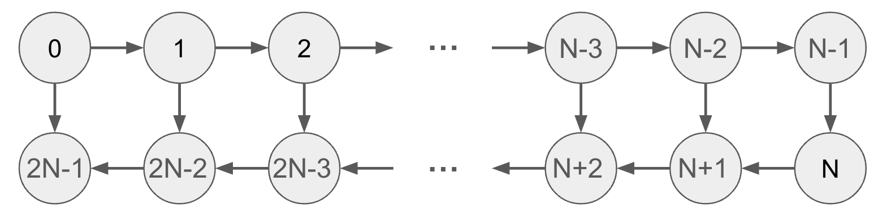

# RD12 Development ML/HPC Application on MN-Core

## Coding Task

Please proceed to the following URL to access the coding task: (omit URL)

Although the exam consists of six problems, you **are not required to solve all of them**.
For this specific theme, you are expected to solve three problems listed below:

- 1 (Undisclosed problem)
- 2 (Undisclosed problem)
- 3 Winning Probability of Poker

Please provide the solutions using one of the following programming languages:

- Python
- C++

## Thematic Task

Select and answer one problem from Problem 1 or Problem 2.

### Problem 1.

NOTE: in this task, you have to read [a Japanese manual](https://projects.preferred.jp/mn-core/assets/mncore2_dev_manual_ja.pdf). If you cannot read this document, we recommend you to take the Problem 2. Sorry for your inconvenience.

Please discuss performance (in FLOPS) of matrix multiplication `C := A x B` (where `A, B,` and `C` are double precision real matrices of dimensions `m x k, k x n,` and `m x n` respectively) on the MN-Core 2 accelerator. This question is divided into two sub-questions, and please answer both of them in a report of approximately 1-2 pages in A4 size.

In your answers, do not include any improvements or innovations that can bring a sense of novelty.

Following are notes on the sub-questions 1 and 2.

- For information about MN-Core 2, please refer to the "About MN-Core 2" section of [MN-Core 2 Whitepaper](https://projects.preferred.jp/mn-core/assets/MN-Core_2_whitepaper_en.pdf) and Chapter 1 of [MN-Core 2 Software Development Manual](https://projects.preferred.jp/mn-core/assets/mncore2_dev_manual_ja.pdf). You can answer the sub-questions only with the specified parts of materials, but you may refer to other materials if needed. In the following, MN-Core 2 specific terms such as device DRAM and local memory will be used without explanation.
- It is assumed that only one MN-Core 2 board is used, and multi-board execution is not considered.
- Assume that the input matrices A and B exist in the device DRAM and the local memory of MN-Core 2, respectively. Also assume that the output matrix C is stored in the local memory of MN-Core 2.
- Only a performance estimation is required in your report and you do not need to discuss actual assembly instructions.

#### Sub-question 1

Based on some basic parameters of the hardware, such as the peak performance of double-precision floating-point arithmetic, the upper limit of performance can be estimated. Please discuss the relationship between matrix dimensions and the upper limit of performance by focusing on several important parameters. You are free to choose combinations of matrix dimensions m, n, k. You may consider variations such as fixing two of the dimensions and varying the remaining one, or setting m=n=k and varying its value.

#### Sub-question 2

Please qualitatively discuss possible factors needed to be considered to achieve a high performance in actual implementations.
Hint: an important factor on CPUs would be efficient utilization of cache memory, but the architecture of MN-Core 2 is significantly different as it does not have cache memory.

#### Submission instructions

Submit your answers in a PDF file named `survey.pdf` that has approximately 1-2 A4-sized pages.

### Problem 2.

Your task is to answer the following three questions.

#### Background

The term **Array layout** describes the rule of assigning each element of a multi-dimensional array into a one-dimensional memory space. For example, there are two typical layouts for an N x M two-dimensional array as follows:

- C format: A[i][j] is assigned to ptr + i \* M + j
- Fortran format: A[i][j] is assigned to ptr + i + j \* N

The proper choice of layout for arrays of multidimensional matrices in numerical computations is an important issue in optimizing execution speed, and machine learning is no exception. Therefore, given a computational graph of a learning model with a simple structure, we consider an algorithm to pre-determine the optimal layout of each array of multidimensional matrices, assuming that the graph is given.

The optimal selection of layout for multi-dimensional arrays in numerical computations significantly influences the execution speed, including in the field of machine learning. Given a computational graph of a simple model, we are considering an algorithm to determine the optimal layout for each multi-dimensional array.

#### Problem description

Assumes a computational graph consisting of 2N vertices as follows:

Each vertex represents a multi-dimensional array, and edges represent their derivation dependencies.

- For i such that 0 <= i <= N, the array at vertex i is computed by some unary function with the array at vertex i-1 as input.
- For i such that N + 1 <= i <= 2N - 1, the array at vertex i is computed by some binary function with the array at vertex i-1 and the array at vertex 2N-i-1 as input.

We have K potential layouts for the arrays. Each dependency e = (v, w) has a K x K running matrix, where the values in column b of row a represent the runtime cost of the dependency when vertex v uses layout a and vertex w uses layout b. Find the suitable array layouts from the K candidates and minimize the sum of runtime costs for all dependencies.

- Question 1: Write a program that defines a computational graph.
- Question 2: Given the computation graph, the dependency cost matrices, and the layout assignments, write a program to find the sum of the running time costs.
- Question 3: By using dynamic programming from the left side of the computational graph, the optimal layout can be efficiently found. Write a program to identify the optimal layout.

#### Submission instructions

Please compile the following into a zip file named survey.zip and submit it:

- Source codes written in C++ that answer questions 1, 2, and 3.
- Add the minimal required comments in the code for readability
- Your execution environment information
- The command line used to compile the sources
- Tests to verify the validity of the output values
