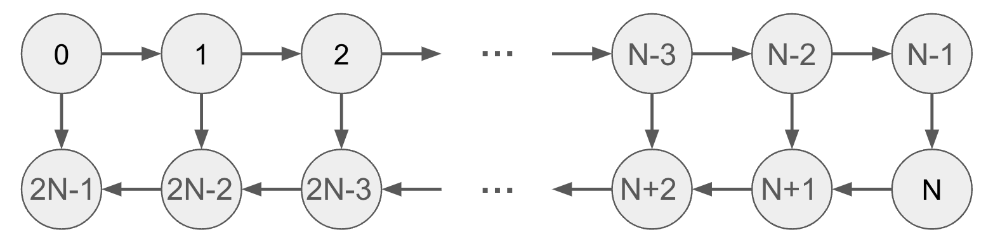

# RD12 MN-Core向けのML/HPCアプリケーション移植（MN-Coreで動かしたいもの募集！）

## コーディングテスト
以下の URL から受験してください。 (URL 省略)

問題は全部で 6 問ありますが、その **全てを解く必要はありません** 。
このテーマでは、以下の 3 問を解いていただきます。
- 1 (非公開の問題)
- 2 (非公開の問題)
- 3 ポーカーの勝率

コーディングテストの回答にあたっては、以下のいずれかの言語を用いて回答してください。
- Python
- C++

## テーマ別課題

問題1 または 問題2 からいずれか1問を選択して解答してください。

### 問題1

MN-Core 2 アクセラレータ上での行列積 `C := A x B` (`A, B, C` はそれぞれ次元 `m x k, k x n, m x n` の倍精度実数行列) の性能(FLOPS値)について論じてください。設問は小問1と小問2に分かれており、両方に解答して合わせてA4 1~2枚程度のレポートとして提出してください。
なお、回答には、新規性を別途主張できるようなアイディアは含めないでください。

まず小問1, 2を通じた条件について述べます。

- MN-Core 2についての資料は[MN-Core 2 Whitepaper](https://projects.preferred.jp/mn-core/assets/MN-Core_2_whitepaper_ja.pdf)の「MN-Core 2について」の節、および[MN-Core 2 Software Development Manual](https://projects.preferred.jp/mn-core/assets/mncore2_dev_manual_ja.pdf)の第1章を参照してください。これらの資料の指定箇所のみ参照して回答できる想定ですが、それ以外の資料を参照しても構いません。以下ではデバイスDRAM、ローカルメモリといったMN-Core 2の用語を説明なしで用います
- MN-Core 2はボード1枚のみを用いる想定とし、マルチボードでの実行は対象外とします
- 行列積の入力について、行列AはMN-Core 2のデバイスDRAMに、行列BはMN-Core 2のローカルメモリに存在するものとします。また、出力Cはローカルメモリに保存するものとします
- 本問で要求されるのは性能の予測のみであり、実際のアセンブリ命令列は考えなくても構いません

#### 小問1

倍精度浮動小数点演算性能などのハードウェアの基本的なパラメータから、性能の上限を見積ることができます。重要なパラメータいくつかに着目し、それに基づいて行列次元と性能上限の関係について論じてください。
行列次元m, n, kの組み合わせは自由に選んでいただいて構いません。3つのうち2つを固定して残り1つを変化させる、m=n=kとしてその値を変化させる、などの工夫をしても良いです。

#### 小問2

具体的な実装において性能のために考慮すべき観点としてはどのようなものがありうるかを定性的に論じてください。
ヒント：例えばCPUであれば重要な観点のひとつとしてキャッシュメモリの有効利用がありますが、MN-Core 2ではキャッシュメモリ自体存在しないなどアーキテクチャが大きく異なります。

#### 提出方法
survey.pdf というファイル名で A4 サイズ 1~2 枚程度の PDF にまとめ、提出してください。

### 問題2
以下の問題文を読み、全ての小問に解答してください。

#### 背景
配列の **レイアウト** とは、多次元配列の各要素を1次元のメモリ空間に割り当てる方法を指します。
たとえば、N x M の2次元配列の代表的なレイアウトとして以下の２つが挙げられます。

- C形式: `A[i][j]` を ptr + i * M + j に割り当てる
- Fortran形式:  `A[i][j]` を ptr + i + j * N に割り当てる

数値計算における多次元行列の配列のレイアウトの適切な選択は、実行速度の最適化において重要な課題であり、機械学習においても例外ではありません。
そこで、単純な構造を持つ学習モデルの計算グラフが与えられた場合を仮定した際に、それぞれの多次元行列の配列の最適なレイアウトを事前に決定するアルゴリズムを考えます。

#### 問題文
以下のような 2N 個の頂点からなる計算グラフを考えます。

グラフの頂点はそれぞれ多次元行列を表し、辺は導出の依存関係を表します。すなわち、

- 0 <= i <= N のとき、頂点 i の行列は、頂点 i-1 の行列を入力として、何らかの１引数関数によって求められます。
- N + 1 <= i <= 2N - 1 のとき、頂点 i の行列は、頂点 i-1 の行列と頂点 2N-i-1 の行列を入力として、何らかの2引数関数によって求められます。

行列のレイアウトとして K 種類の候補があります。
各依存関係 e = (v, w) に対してそれぞれ K x K の実行列が与えられ、a 行 b 列目の値は、頂点 v がレイアウト a を、頂点 w がレイアウト b を持つときの依存関係にかかる実行時間コストを表しています。
このグラフの各頂点に対して K 種類の候補から適切に行列のレイアウトを求め、全ての依存関係にかかる実行時間コストの総和を最小化しましょう。

- 小問1: 計算グラフを定義するプログラムを記述してください。
- 小問2: 計算グラフ、依存関係のコスト行列、レイアウトの割り当てが与えられたときに、実行時間コストの総和を求めるプログラムを記述してください。
- 小問3: 最適なレイアウトは、図の左側から順に動的計画法で効率的に求められます。最適なレイアウトを求めるプログラムを記述してください。

#### 提出方法

以下を全て含むファイル群を survey.zip という名前の zip ファイルにまとめ、提出してください。

- 小問1から3の解答プログラムのC++ソースコード
- ソースコードの可読性のために必要な最小限のコメント
- プログラムの実行環境情報
- コンパイルを行うためのコマンドライン
- 出力の値の正当性が確認できるテストコード
